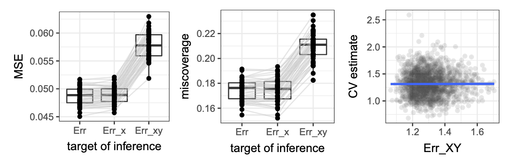
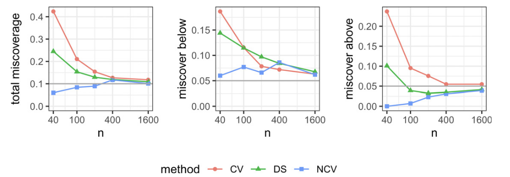

Nearly 40 years ago, the central question was if a model is fitted and evaluated on the same observations, how much does the apparent error underestimate its future prediction error? The [previous discussion](01.qmd) focused on this problem through the idea of __optimism__. The data are used twice ($D\to \hat f$ then $D\to \text{err}(\hat f)$), so the resulting appearent error tends to be too favorable. @efronHowBiasedApparent1986 expressed this different as 

$$
\text{op} = \text{Err} - \text{err},
$$

and studied ways to estimate and correct it. This also led to connections among bootstrap correction, cross-validation (CV), and what we now call *generalization error*.

Over the following four decades, the question became more precise:

```{mermaid}
%%| fig-align: center
flowchart TD
    A[How optimisitic is training error?]
    B[How should we estimate prediction error?]
    C[How uncertain is that estimate?]
    D[What prediction error are we estimating?]

    A --> B
    B --> C
    C --> D
```

@batesCrossvalidationWhatDoes2024 address the last two questions. Their paper provides an endpoint to this development. We now can't just say that the cross validation error estimates the generalization error, only after we specify what exactly *generalization error* means.

## From optimism to cross-validation

Efron's earlier work treated prediction-error estimation as a resampling problem. @efronLeisurelyLookBootstrap1983 studied CV and boostrap estimators for the error rate of a prediction rule, particularly in small sample. @efronHowBiasedApparent1986 then approached the same problem through apparent-error optimism, connecting prediction error estimation to CV, bootstrap, $C_p$, and AIC. Thus the theme was established in mid-1980s was the performance on the observed sample was different from the performance on future observations. As CV became standard in statistical learning, attention moved from correcting apparent error to understanding the statistical behavior of CV itself.

A major complication is uncertainty. @bengioNoUnbiasedEstimator2004 showed that there is no universally unbiased estimator of the variance of $K$-fold CV from a single CV run. The main reason is that CV errors are dependent because training sets overlap. More recent work developed asymptotic theories under assumptions related to the stability of the learning algorithm. @austernAsymptoticsCrossvalidation2020 studied asymptotic normality of cross-validated risk, while @bayleCrossvalidationConfidenceIntervals2020 developed asymptotically valid confidence intervals for CV test error under stability conditions. And, finally, @batesCrossvalidationWhatDoes2024 sit at end of this progression and ask a question that is prior to all of them:

> *What exactly is the target of cross-validation?*

## Prediction error as a random quantity

Let $\mathbf X=(X_1, \dots, X_n)$, $\mathbf Y=(Y_1, \dots, Y_n)$, where $(X_i, Y_i) \sim P$ are i.i.d. random variables. Let $\mathcal A$ denote a model-fitting algorithm. Given the observed data, $\hat \theta = \mathcal A(\mathbf X, \mathbf Y)$. For a parameter value $\theta$, let $\hat f(x, \theta)$ denote the corresponding prediction at feature value $x$, and let $\ell (\hat y, y)$ be a nonnegative loss function, i.e. a [metric](https://en.wikipedia.org/wiki/Metric_space) on the prediction space $\mathcal Y$.  

::: {#def-out-of-sample-prediction-error}

## Out-of-sample prediction error

The **out-of-sample prediction error**, denoted $\text{Err}_{XY}$, is the error of the model fitted to the **observed training sample** $(X_{n+1}, Y_{n+1})\sim P$:

$$
\text{Err}_{XY} \coloneqq \E\left[\ell (\hat f(X_{n+1}, \hat \theta), Y_{n+1})\mid (\mathbf X, \mathbf Y)\right].
$$

:::

Before observing the training sample, $\text{Err}_{XY}$ is a random quantity. The expectation is taken over the distribution of $(X_{n+1}, Y_{n+1})$ conditional on the observed training sample. This is the quantity that Efron called $\text{Err}$ in his 1986 paper (@efronHowBiasedApparent1986).

Instead of conditioning on the particular sample that happened to be observed, we also consider about the expectation of this quantity across possible training sets. 

::: {#def-expected-prediction-error}

## Expected prediction error

The average out-of-sample error obtained by applying the fitting algorithm $\mathcal A$ to repeated datasets of size $n$ drawn from $P$ is called the **expected prediction error**:

$$
\text{Err} \coloneqq \E \left[\text{Err}_{XY}\right]
$$

:::

To understand why these two targets behave differently, Bates et al. introduce 

$$
\text{Err}_{X} \coloneqq \E[\text{Err}_{XY}\mid \mathbf X]
$$

Here the observed features $\mathbf X$ are fixed, but the randomness in $\mathbf Y\mid \mathbf X$ is averaged out. We therefor now have three different targets of prediction error estimation: $\text{Err}_{XY}$, $\text{Err}$, and $\text{Err}_{X}$.


To make this relationship precise, we can write the decomposition of the variance of $\Err_{XY}$ as

$$
\Var(\Err_{XY}) = \underbrace{\E_{\mathbf X}[\Var(\Err_{XY}\mid \mathbf X)]}_{\text{var due to } \mathbf Y \mid \mathbf X} + \underbrace{\Var(\Err_X)}_{\text{var due to } \mathbf X}
$$

::: {.derivation-note}
[How can we derive this equation?]{.derivation-note-trigger tabindex="0"}

::: {.derivation-note-body}
This is the law of total variance. Start by conditioning on the observed feature values $\mathbf X$:

$$
\Var(\Err_{XY})
= \E_{\mathbf X}\left[
    \E\left[
      \left(\Err_{XY} - \E[\Err_{XY}]\right)^2
      \mid \mathbf X
    \right]
  \right].
$$

Add and subtract $\Err_X = \E[\Err_{XY}\mid \mathbf X]$ inside the square:

$$
\Err_{XY} - \E[\Err_{XY}]
=
\left(\Err_{XY} - \Err_X\right)
+
\left(\Err_X - \E[\Err_{XY}]\right).
$$

After expanding, the cross term has conditional mean zero because
$\E[\Err_{XY} - \Err_X\mid \mathbf X]=0$. Therefore,

$$
\Var(\Err_{XY})
=
\E_{\mathbf X}[\Var(\Err_{XY}\mid \mathbf X)]
+
\Var(\Err_X).
$$
:::
:::

The first term measures variation caused by the responses $\mathbf Y$ coniditional on the observed predictors. The second term measures variation caused by the feature sample $\mathbf X$.

## Cross-validation as an estimator

Let $\mathcal I=\{1, \dots, n\}$ be partitioned randomly into $K$ disjoint folds $\mathcal I_1, \dots, \mathcal I_K$, each of size $m=\frac{n}{K}$. For the first fold, we define $\hat \theta^{(-1)} = \mathcal A(X_j, Y_j)_{j\in \mathcal I \setminus \mathcal I_1}$ is the fitted parameters obtained without observations in $\mathcal I_1$. For $i\mathcal I_1$, the held-out loss is $e_i = \ell(\hat f(x_i, \hat \theta^{(-1)}), y_i)$. Losses for the remaining folds are defined similarly.

::: {#def-kfold-cross-validation-error}

## K-fold cross-validation error

The **K-fold cross-validation error** is the average of the held-out losses across all folds:

$$
\widehat \Err^{(CV)} \coloneqq \overline e = \frac{1}{n}\sum_{i=1}^n e_i
$$
:::

So now we can see the problem. We have one estimator $\widehat \Err^{(CV)}$ and three different targets $\Err_{XY}$, $\Err_X$, and $\Err$. The question is which target does cross-validation estimate?

## A linear-model result

To answer this question, Bates et al. consider a homoscedascity linear model with 

$$
y_i = x_i^\top \theta + \epsilon_i \quad \text{where} \quad \epsilon_i \overset{\text{i.i.d.}}{\sim} N(0, \sigma^2)
$${#eq-linear-model}

with $\epsilon=(\epsilon_1, \dots, \epsilon_n)$ independent of $\mathbf X$.

Before reaching the main result, the define a class of prediction error estimators that satisfy a certain linearity condition.

::: {#def-linearly-invariant-estimators}

## Linearly invariant estimators

A prediction-error estimator $\widehat \Err((X_i, Y_i),\dots, (X_n, Y_n), U)$ is **linearly invariant** if, for every $\kappa \in \mathbb R^p$ and $x_i, y_i, u$ we have

$$
\widehat \Err((x_1, y_1), \dots, (x_n, y_n), u) = \widehat \Err((x_1, y_1 + x_1^\top \kappa), \dots, (x_n, y_n + x_n^\top \kappa), u)
$$

The random variable $U$ allows the estimator itself to contain randomness, such as the random partitioning of the data into folds for cross-validation.
:::

With OLS fitting, $\widehat \Err^{(CV)}$ satisfies this property:

::: {#lem-cv-linear-invariant}
When using OLS as the fitting algorithm and squared-error loss, the cross-validation estimate of prediction error, $\hat \Err^{(CV)}$, is linearly invariant.
:::

As we may recognize, adding the same linear signal $x_i^\top \kappa$ to every response changes the fitted coefficients, but it does not change the residual structure on which this class of error estimators depends.

::: {#thm-conditional-independence}

## Conditional Independence

Assume the homoscedastic Gaussian linear model (@eq-linear-model) holds and that we use squared-error loss. Let $\widehat \Err$ be a linearly invariant estimate of prediction error (such as $\widehat \Err^{(CV)}$ using OLS as the fitting algorithm). Then,

$$
\widehat \Err \indep \Err_{XY}\mid \mathbf X.
$$

:::

CV uses the same observed sample from which the final OLS is fitted, yet conditional on $\mathbf X$, its estimate is independent of that model's actual prediction error. This is a surprising result.

For a more detailed derivation of why this happens, see the appendix note on [OLS, linear invariance, and conditional independence](../appendices/ols-cv-independence.qmd).


As a result, any linearly invariant estimator, such as CV, has lower MSE as an estimate of $\Err_X$ than as an estimate of $\Err_{XY}$.


::: {#cor-cv-errx}

Under the conditions of @thm-conditional-independence,

$$
\E \left[(\widehat \Err - \Err_{XY})^2 \right] = \E \left[(\widehat \Err - \Err_{X})^2\right] + \underbrace{\E[\Var(\Err_{XY}\mid Y)]}_{\geq 0}
$$

:::

Since the last term is nonnegative, we have 

$$
\E[(\widehat \Err - \Err_{XY})^2]\geq \E\left[(\widehat \Err - \Err_{X})^2\right].
$$

Thus CV is closer to $\Err_{X}$ than to $\Err_{XY}$ <u>under this model</u>.

The remaining question is how close $\Err_X$ is to $\Err$. To study this, Bates et al. considers the proportional asymptotic regime 

$$
n>p, \quad n, p \to \infty, \quad \frac{n}{p}\to \lambda > 1.
$${#eq-proportional-asymptotics}

This is different from classical asyptotics with fixed $p$. When $p$ remains fixed and $n\to \infty$, the three errors become so close that distinguishing them is less informative.

::: {#thm-assymptotic-errx-err}

Suppose the homoscedastic Gaussian linear model (@eq-linear-model) holds and that we use squared-error loss. In addition, assume that feature vectors $X_i\sim \mathcal N(0, \Sigma_p)$ for any full-rank $\Sigma_p$. Then, in the proportial asymptotic limit in (@eq-proportional-asymptotics), we have 

$$
\E_X[\Var(\Err_{XY}\mid \mathbf X)] =\Theta\left(\frac{1}{n}\right),
$$

and 

$$
\Var(\Err_X) = \E(\Err_X - \Err)^2 = \Theta\left(\frac{1}{n^2}\right),
$$

as $n, p \to \infty$.
:::

Therefore the fluctuations of $\Err_X - \Err$ are much smaller than the fluctuations of $\Err_{XY} - \Err_{X}$. 


::: {#cor-cv-err}

In the setting of @thm-assymptotic-errx-err, $\Corr(\Err_{XY}, \Err_X)\to 0$ as $n, p \to \infty$. Moreover, for any linearly invariant estimator $\widehat \Err$ (such as $\widehat \Err^{(CV)}$ using OLS as the fitting algorithm), 

$$
\Corr(\Err_{XY}, \widehat \Err) \to 0, \quad \text{as } n, p \to \infty.
$$
:::

Consequently, in the proportional asymptotic limit, $\widehat \Err^{(CV)}$ is a good estimator of $\Err_X$, but it is not a good estimator of $\Err_{XY}$.

::: {#cor-cv-errx-err}

In the setting of @thm-assymptotic-errx-err, let $\widehat \Err$ be any linearly invariant estimator (such as $\widehat \Err^{(CV)}$ using OLS as the fitting algorithm). Suppose in addition that $\Var(\widehat \Err) \to 0$ (an extremly weak condition satisfied by any reasonable estimator). Then,

$$
\begin{aligned}
\E\left[(\widehat \Err - \Err_{XY})^2\right] - \E\left[(\widehat \Err - \Err_X)^2\right] &= \Omega\left(\frac{1}{n}\right), \\
\E\left[(\widehat \Err - \Err_{XY})^2\right] - \E\left[(\widehat \Err - \Err)^2\right] &= \Omega\left(\frac{1}{n}\right)\\ 
\E\left[(\widehat \Err - \Err)^2\right] - \E\left[(\widehat \Err - \Err_{X}))^2\right] &= O\left(\frac{1}{n}\right).
\end{aligned}
$$
:::

::: {.callout-caution title="Caution"}

In $K$-fold CV, each fitted model uses $n\frac{K-1}{K}$ observations, while $\Err$ and $\Err_{XY}$ are defined using models fitted on $n$ observations. Hence $\E \left[\widehat Err^{(CV)}\right]$ need not equal $\Err$ or $\Err_{XY}$. In the classical parametric regime ($p$ fixed, $n\to \infty$), the bias is typically of order $O(\frac{1}{n})$, and is small relative to the sampling variance. In proportional high dimensional regimes, it can be larger. Increasing $K$ reduces the difference between the CV training size and $n$. 

Since both $\widehat \Err^{(CV)}$ and $\Err_{XY}$ are random quantities, we cannot use the usual bias-variance decomposition. However, by @cor-cv-err, these two quantites are asymptotically uncorrelated, yielding the following:

$$
\E\left[(\widehat \Err - \Err_{XY})^2\right] \approx \underbrace{\left(\E\left[(\widehat \Err - \Err)^2\right]\right)}_{\text{bias}^2} + \underbrace{\E\left[(\widehat \Err-\E[\widehat \Err])^2\right]}_{\text{variance of } \widehat \Err} + \underbrace{\E\left[(\Err_{XY}- \Err)^2\right]}_{\text{variance of } \Err_{XY}}.
$$

:::

## From Estimation to Inference

Recall the $K$-fold CV estimate in @def-kfold-cross-validation-error. An estimate of its standard error is given by 

$$
\widehat{\text{SE}} \coloneqq \frac{1}{\sqrt{n}} \sqrt{\frac{1}{n-1}\sum_{i=1}^n(e_i -\overline e)^2}.
$$

The problem is that this formula behaves as if the $e_i$ were independent, but they are not. To see this more clearly, we write 

$$
\Var(\overline e) = \Var(\frac{1}{n}\sum_{i=1}^n e_i) = \frac{1}{n^2}\sum_{i=1}^n \Var(e_i) + \frac{2}{n^2}\sum_{i<j} \Cov(e_i, e_j).
$$

If the losses were independent, then $\Cov(e_i, e_j)$ would be zero, and the usual formula would be valid. But cross-validation does not have this structure. Two held-out predictions may be produced by models trained on overlapping datasets. Hence their errors can be correlated.


### Confidence Intervals with Nested Cross-Validation

::: {#def-cv-mse}

For a sample of size $n$ split into $K$ folds, the **cross-validation MSE** is 

$$
\text{MSE}_{K, n} \coloneqq \E\left[(\widehat \Err^{(CV)} - \Err_{XY})^2\right].
$$

:::

A small notice is that this MSE appear incosistent with previous section, where we claimed that $\widehat \Err^{(CV)}$ estimates $\Err$ more accurately than $\Err_{XY}$, yet the confidence interval is calibrated toward $\Err_{XY}$. 

Ordinarily, a confidence interval (ci) is centered at an estimator and uses its sampling variance:

$$
\hat \theta \pm z_{1-\alpha/2}\sqrt{\Var(\hat \theta)}.
$$

The problem is $\widehat \Err^{(CV)}$ can be biased as discussed in the previous section. Therefore, 

$$
\text{MSE} = \Var + \text{Bias}^2
$$

is more relevant than variance alone.

Their interval has the form 

$$
\widehat \Err^{(NCV)}-\widehat{\text{bias}} \pm z_{1-\alpha/2}\sqrt{\widehat{\text{MSE}}}.
$$

### The holdout MSE identity

Suppose the full index set $\mathcal I=\{1,\dots, n\}$ is randomly partitioned to $\mathcal I_{\text{(train)}}$ and $\mathcal I_{\text{(out)}}$. let $(\tilde{\mathbf X}, \tilde{\mathbf Y})$ denote the observations in $\mathcal I_{\text{(train)}}$. Using only these observations, we fit $\hat \theta^{\text{(train)}}=\mathcal A(\tilde{\mathbf X}, \tilde{\mathbf Y})$. The true prediction error of this fitted model is denoted $\Err_{\tilde X \tilde Y}$. 

Now suppose that, using only the training subset, we also construct some estimator $\widehat \Err_{\tilde X \tilde Y}$ such as CV. The untouched outer set gives an independent estimate of the fitted model's prediction error. For $i\in \mathcal I_{\text{(out)}}$, let 

$$
e_i^{(\text{out})} = \ell(\hat f(X_i, \hat \theta^{\text{(train)}}), Y_i)
$$

be the losses of the fitted model, and let

$$
\overline e^{\text{(out)}} = \frac{1}{|\mathcal I_{\text{(out)}}|}\sum_{i\in \mathcal I_{\text{(out)}}} e_i^{\text{(out)}}
$$

be the average of these losses. Then we have the following identity:

::: {#lem-holdout-mse-identity}

In the setting above 

$$
\underbrace{\E\left[(\widehat \Err_{\tilde X \tilde Y} -\Err_{\tilde X \tilde Y})^2\right]}_{\text{MSE}} = \underbrace{\E\left[(\widehat \Err_{\tilde X \tilde Y} - \overline e^{\text{(out)}})^2\right]}_{\text{(a)}} - \underbrace{\E\left[(\overline e^{\text{(out)}} - \Err_{\tilde X \tilde Y})^2\right]}_{\text{(b)}}
$$

:::

The first term (a) measures the observed disagreement between the internal prediction error estimate and the outer holdout error. Notice that this agreement contains two type of noise: the error of the CV estimator + the sampling noise in the holdout set. The second term (b) measures the sampling noise in the holdout set. Therefore, subtracting (b) from (a) gives an unbiased estimate of the MSE of the internal prediction error estimator.

> **How term (b) can be estimated?**

Conditional on the training set, the outer observations are i.i.d. from $P$. Hence 

$$
\Var(\overline e^{\text{(out)}}\mid \tilde{\mathbf X}, \tilde{\mathbf Y}) = \frac{1}{|\mathcal I_{\text{(out)}}|}\Var(e_i^{\text{(out)}}\mid \tilde{\mathbf X}, \tilde{\mathbf Y})
$$

So term (b) can be estimated by $\frac{s^2_{\text{(out)}}}{|\mathcal I_{\text{(out)}}|}$, where $s^2_{\text{(out)}}$ is the sample variance of the outer losses $e_i^{\text{(out)}}$.

### The nested CV MSE estimator

For split $b$, obtain $\widehat{\Err}_{\tilde X \tilde Y}^{(b)}$ using the training set and $\overline e^{\text{(out)}, (b)}$ using the outer holdout set. Then we estimate 

$$
a_b = (\widehat \Err_{\tilde X \tilde Y}^{(b)} - \overline e^{\text{(out)}, (b)})^2,
$$

and 

$$
b_b = \frac{s^2_{\text{(out)}, (b)}}{|\mathcal I_{\text{(out)}}|}.
$$

We then average these over $B$ splits to obtain

$$
\widehat{\text{MSE}}^{(NCV)} = \frac{1}{B}\sum_{b=1}^B (a_b - b_b).
$$

::: {#thm-ncv-mse-estimator}

For a nested CV with a sample of size $n$, $\E[\widehat{\text{MSE}}^{(NCV)}] = \text{MSE}_{K-1, n'}$, where $n' = n\frac{K-1}{K}$.

:::

The nested procedure does not directly provide an unbiased estimate of $\text{MSE}_{K, n}$ for $K$-fold CV on the full $n$-observation sample. Instead, its target is the MSE of $K-1$-fold CV on the sample of size $n' = n\frac{K-1}{K}$ used to fit the models in the inner loop.

To translate the nested-CV MSE estimate back toward the desired full-sample scale, Bates et al/ recommend

$$
\widehat{\text{MSE}} = \frac{K-1}{K}\widehat{\text{MSE}}^{(NCV)}.
$$

This rescaled estimator is not guaranteed to be unbiased for $\text{MSE}_{K, n}$.

## Simulation Studies

This paper uses simulations for two distinct purposes. Some experiments test the estimand theory from @thm-conditional-independence; other test the confidence interval theory from @thm-ncv-mse-estimator.

| Study | Model | Main quantities studied | Purpose | Main finding |
|-------|-------|------------------------|---------|--------------|
| Motivating sparse classification example, Fig. 1 | $n$=90, $p$=100; Gaussian $X$; 4 coefficients; $L_1$ penalized LR | $\widehat{\Err}^{\text{(CV)}}$, $\Err_{XY}$, naive 90% CV intervals | Show that ordinary CV confidence intervals can fail | Nominal 10% miscoverage becomes about 31%; intervals need to be roughly 1.6 times wider |
| Linear model estimand exp, Fig. 3 | $n$=100, $p$= 20; Gaussian features; OLS | MSE relative to $\Err$, $\Err_{XY}$; CV vs $\Err_{XY}$ corr | Demonstrate Thm 1 / Cor 1 in finite samples | CV has more precise for $\Err$ and $\Err_{X}$ than for $\Err_{XY}$ |
| Proportional-asymptotic scaling, Fig. 5 | Gaussian linear regression with $n, p \to \infty$, $n/p\to \lambda > 1$ | Scaling of differences among $\Err$, $\Err_X$, $\Err_{XY}$ | Empirically verify Thm 2 | Simulation follows the predicted $n$-scaling. |
| Low dimensional logistic coverage, Tab 1 | $n=100$, $p=20$; Gaussian $X$; unregularized logistic regression; two signal strengths | CV, NCV, data-splitting coverage and interval widths | Test Sec 4 beyond the exact OLS theory | NCV coverage is closer to nominal coverage |
| LR estimand study, Fig. 8 | LR; Bayes error 22.5%, varying $n, p$ | $\Corr(\widehat{\Err}^{(CV)})$; precision for $\Err$ vs. $\Err_{XY}$ | Check whether sec 3 persists outside OLS | Correlation remains small; CV remains slightly more precise for $\Err$ |
| High dimensional sparse lr, Tab 2 Fig. 9| $p$=1000, $n\in\{90,200\}$; sparse logistic; correlated or ind. predictors| Coverage and width of CV, NCV, data splitting | Stress-test NCV in a $p\gg n$ setting | NCV gives much better coverage than naive CV |
| OLS inference exp, Fig. 10 | $p$=20, $X_{ij}\sim \mathcal N(0,1)$, $Y=X\theta +\epsilon$, $\epsilon\sim \mathcal N(0,1)$; varying $n$ | Miscoverage of CV, NCV, data splitting | Evaluate Sec 4 | NCV has good coverage across $n$, naive CV remains poor until the sample becomes large |
| Real-data subsampling | Communities and crime and crop-mapping data | CV/NCV/data-splitting coverage after repeated sampling | Check whether simulation behavior appears in real datasets  | NCV is much closer to nominal coverage; data splitting performs poorly for small $n$ |

### What does CV estimate?

{#fig-mse-miscoverage-cv}

We first reproduce the idea behind @fig-mse-miscoverage-cv. Consider 

$$
Y = X\theta + \epsilon, \quad \epsilon \sim \mathcal N(0, I_n), \quad X\overset{\text{i.i.d.}}{\sim} \mathcal N_p(0, I_p), \quad n=100, p=20.
$$

The specific value of $\theta$ is not important for the OLS invariance argument, so we can take $\theta = 0$. For each generated training sample we compute three quantities: the ordinary 10-fold CV estimate $\widehat{\Err}^{(CV)}$, the prediction error of the OLS model fitted to that training sample $\Err_{XY}$, and the expected prediction error $\Err$. Since we know the DGP, we can estimate $\Err_{XY}$ almost exactly using a very large independent test sample. We can also estimate $\Err$ by averaging $\Err_{XY}$ over many MC replications.

Our main interest is whether $\widehat{\Err}^{(CV)}$ can track the fluctuations of $\Err_{XY}$, or instead fluctuates around the common average.

```{python}
import numpy as np
import pandas as pd 
import matplotlib.pyplot as plt

from sklearn.linear_model import LinearRegression, Ridge
from sklearn.model_selection import cross_val_score, KFold
from sklearn.base import clone 

rng = np.random.default_rng(6400)
```

We will use mean squared prediction error throughout.

```{python}
def mse(y_true, y_pred):
    return np.mean((y_true - y_pred) ** 2)
```

> **Data Generating Process (DGP)**

```{python}
def simulate_linear_data(n, p, beta=None, sigma=1.0, rng=None):
    if rng is None:
        rng = np.random.default_rng()
    if beta is None:
        beta = np.zeros(p)
    X = rng.normal(size=(n, p))
    eps = rng.normal(loc=0, scale=sigma, size=n)
    y = X @ beta + eps
    return X, y
```

> **Computing $\widehat{\Err}^{(CV)}$**

```{python}
def cv_error(model, X, y, K=10, seed=6400):
    cv = KFold(n_splits=K, shuffle=True, random_state=seed)
    scores = cross_val_score(clone(model), X, y, cv=cv, scoring='neg_mean_squared_error')
    return -np.mean(scores)
```

> **Approximating $\Err_{XY}$**

Once the training sample has been observed, we fit OLS using all $n$ observations, then generate an enormous independent test set $(X_{\text{test}}, Y_{\text{test}}) \sim P$.

```{python}
def instance_specific_error(model, X, y, beta, sigma=1.0, n_test=50_000, rng=None):
    if rng is None:
        rng = np.random.default_rng()
    fitted = clone(model)
    fitted.fit(X, y)
    X_test, y_test = simulate_linear_data(n=n_test, p=X.shape[1], beta=beta, sigma=sigma, rng=rng)
    y_pred = fitted.predict(X_test)
    return mse(y_test, y_pred)
```

For a sufficiently large $n_{\text{test}}$, this is approximately

$$
\Err_{XY} = \E[(\hat f(X_{n+1}) - Y_{n+1})^2\mid \mathbf X, \mathbf Y]
$$

> **Monte Carlo experiment**

```{python}
def run_estimand_simulation(R=1000, n=100, p=20, K=10, sigma=1.0, n_test=50_000, seed=6400):
    rng = np.random.default_rng(seed)
    beta = np.zeros(p)
    model = LinearRegression()
    results = []
    
    for r in range(R):
        X, y = simulate_linear_data(n=n, p=p, beta=beta, sigma=sigma, rng=rng)
        cv_err = cv_error(model, X, y, K=K, seed=r)
        err_xy = instance_specific_error(model, X, y, beta=beta, sigma=sigma, n_test=n_test, rng=rng)
        results.append({'replicate': r, 'cv_error': cv_err, 'err_xy': err_xy})
    return pd.DataFrame(results)
```

```{python}
results_ols = run_estimand_simulation(R=1000, n=100, p=20, K=10, n_test=50_000)

results_ols.head()
```

> **Estimating $\Err$**

Across the repeated training samples, $\Err=\E[\Err_{XY}]$ is estimated by $\widehat{\Err} = \frac{1}{R}\sum_{r=1}^R \Err_{XY}^{(r)}$.

```{python}
err_average = results_ols['err_xy'].mean()
print(f"Estimated Err: {err_average:.4f}")
```

Now compare the MSE of CV relative to the two targets.

```{python}
mse_to_err_xy = np.mean((results_ols['cv_error'] - results_ols['err_xy']) ** 2)
mse_to_err = np.mean((results_ols['cv_error'] - err_average)**2)
summary_estimand = pd.DataFrame({
    'Target': ['Err', 'Err_XY'],
    'MSE of CV': [mse_to_err, mse_to_err_xy]
})

summary_estimand
```

According to the paper, we expect 

$$
\text{MSE}(\widehat{\Err}^{(CV)}, \Err) < \text{MSE}(\widehat{\Err}^{(CV)}, \Err_{XY})
$$

> **Weak correlation**

Now we calculate $\Corr(\widehat{\Err}^{(CV)}, \Err_{XY})$.

```{python}
correlation = results_ols[['cv_error', 'err_xy']].corr().iloc[0, 1]
print(f"Correlation between CV error and Err_{{XY}}: {correlation:.4f}")
```

And plot the relationship.

```{python}
fig, ax = plt.subplots(figsize=(7,5))

ax.scatter(results_ols['err_xy'], results_ols['cv_error'], alpha=0.5)
ax.axhline(err_average, color='red', linestyle='--', label=r'$\widehat{\mathrm{Err}}$')
ax.set_xlabel(r'$\mathrm{Err}_{XY}$')
ax.set_ylabel(r'$\widehat{\mathrm{Err}}^{(CV)}$')
ax.set_title('CV error vs. instance-specific prediction error')
ax.legend()
plt.show()
```

This provides a concrete interpretation of 

$$
\widehat{\Err}^{(CV)} \indep \Err_{XY}\mid \mathbf X
$$

### Reproducing the inference problem 

The naive CV interval treats $e_1, \dots, e_n$ as independent observations. For each observation, we therefore need its out-of-fold squared error.

```{python}
def cv_losses(model, X, y, K=10, seed=6400):
    n = len(y)
    losses = np.empty(n)
    cv = KFold(n_splits=K, shuffle=True, random_state=seed)

    for train_idx, test_idx in cv.split(X):
        fitted = clone(model)
        fitted.fit(X[train_idx], y[train_idx])
        pred = fitted.predict(X[test_idx])
        losses[test_idx] = (pred - y[test_idx]) ** 2
    return losses
```

The naive standard error is then $\widehat{\text{SE}}=\frac{s_e}{\sqrt{n}}$, where $s_e$ is the sample standard deviation of the $e_i$.

```{python}
def naive_cv_interval(model, X, y, K=10, alpha=0.10, seed=6400):
    from scipy.stats import norm
    losses = cv_losses(model, X, y, K=K, seed=seed)
    err_hat = np.mean(losses)
    se_hat = np.std(losses, ddof=1) / np.sqrt(len(losses))
    z = norm.ppf(1 - alpha / 2)
    lower = err_hat - z * se_hat
    upper = err_hat + z * se_hat
    return {
      'estimate': err_hat,
      'se': se_hat,
      'lower': lower,
      'upper': upper
    }
```

> **Checking coverage**

For each MC training sample we know approximately the true $\Err_{XY}$ from the large test population. Therefore we can ask whether the nominal 90% CV interval contains it.

```{python}
def run_naive_coverage_simulation(R=1000, n=100, p=20, K=10, sigma=1.0, n_test=50_000, seed=6400):
    rng = np.random.default_rng(seed)
    beta = np.zeros(p)
    model = LinearRegression()
    output = []
    
    for r in range(R):
        X, y = simulate_linear_data(n=n, p=p, beta=beta, sigma=sigma, rng=rng)
        ci = naive_cv_interval(model, X, y, K=K, alpha=0.10, seed=r)
        err_xy = instance_specific_error(model, X, y, beta=beta, sigma=sigma, n_test=n_test, rng=rng)
        covered = ci['lower'] <= err_xy <= ci['upper']
        output.append({
            'replicate': r,
            'err_xy': err_xy,
            'cv': ci['estimate'],
            'lower': ci['lower'],
            'upper': ci['upper'],
            'covered': covered
        })
    return pd.DataFrame(output)
```

```{python}
coverage_results = run_naive_coverage_simulation(R=1000, n=100, p=20)

coverage_results["covered"].mean()
```

For a nominal 90% interval, we want $P(\Err_{XY} \in \text{CI}) \approx 0.9$. However, the actual coverage is much lower.

Now vary $n\in \{40, 100, 200, 400, 800, 1600\}$ and see how the coverage changes.

```{python}
def coverage_by_n(n_values, R=500, p=20, K=10, seed=6400):
    rows = []
    for j, n in enumerate(n_values):
        result = run_naive_coverage_simulation(R=R, n=n, p=p, K=K, seed=seed+j)
        coverage = result["covered"].mean()
        rows.append({'n': n, 'coverage': coverage, 'miscoverage': 1-coverage})
    return pd.DataFrame(rows)
```

```{python}
n_values = [40, 100, 200, 400, 600, 800, 1000, 1200, 1400, 1600]
coverage_curve = coverage_by_n(n_values, R=500, p=20, K=10)
coverage_curve.head()
```

Plot:
```{python}
fig, ax = plt.subplots(figsize=(7,5))
ax.plot(coverage_curve['n'], coverage_curve['miscoverage'], marker='o')
ax.axhline(0.1, color='red', linestyle='--', label='Nominal miscoverage')
ax.set_xlabel('Sample size n')
ax.set_ylabel('Miscoverage')
ax.set_title('Coverage of Naive CV Intervals')
ax.legend()
plt.show()
```

We can compare our simulation results with the @fig-coverage-cv in the paper. The miscoverage is much higher than the nominal 10% for small $n$, and only approaches the nominal level as $n$ becomes large.

{#fig-coverage-cv}

### The nested CV MSE idea

For one outer split $\mathcal I = \mathcal I_{\text{(train)}} \cup \mathcal I_{\text{(out)}}$, we can compute the inner CV estimate $\widehat{\Err}_{\tilde X \tilde Y}$ by CV inside the training data, and $\overline e^{\text{(out)}}$ by evaluating the fitted model on the outer holdout set. Then we can estimate 

$$
(a) = (\widehat{\Err}_{\tilde X \tilde Y} - \overline e^{\text{(out)}})^2
$$

and 

$$
(b) = \frac{s^2_{\text{(out)}}}{|\mathcal I_{\text{(out)}}|}.
$$

By @lem-holdout-mse-identity, $\text{MSE} = \E[(a) - (b)]$. 

```{python}
from sklearn.model_selection import train_test_split

def nested_mse_estimate(model, X, y, K=10, B=200, test_fraction=None, seed=6400):
    if test_fraction is None:
        test_fraction = 1 / K
    rng = np.random.default_rng(seed)
    a_values = []
    b_values = []
    inner_errors = []
    n = len(y)

    for b in range(B):
        split_seed = int(rng.integers(0, 2**31-1))
        train_idx, out_idx = train_test_split(np.arange(n), test_size = test_fraction, random_state=split_seed)
        X_train, y_train = X[train_idx], y[train_idx]
        X_out, y_out = X[out_idx], y[out_idx]

        # inner CV estimate
        inner_err = cv_error(model, X_train, y_train, K=K-1, seed=split_seed)

        # fit on entire outer-training set
        fitted = clone(model)
        fitted.fit(X_train, y_train)
        out_pred = fitted.predict(X_out)
        out_losses = (out_pred - y_out) ** 2
        out_error = np.mean(out_losses)

        # term (a) 
        a_hat = (inner_err - out_error) ** 2
        # term (b) 
        b_hat = np.var(out_losses, ddof=1) / len(out_losses)

        a_values.append(a_hat)
        b_values.append(b_hat)
        inner_errors.append(inner_err)
    mse_ncv = (np.mean(a_values) - np.mean(b_values))
    mse_ncv = max(mse_ncv, 0)  # ensure non-negative
    err_ncv = np.mean(inner_errors)
    return {
      "err_ncv": err_ncv,
      "mse_ncv": mse_ncv,
    }
```

@thm-ncv-mse-estimator states that the unadjusted quantity corresponds to a slightly smaller effective sample size. Bates et al. recommend the approximate rescaling $\widehat{\text{MSE}} = \frac{K-1}{K}\widehat{\text{MSE}}^{(NCV)}$ to account for this.

```{python}
def nested_cv_interval(model, X, y, K=10, B=200, alpha=0.1, seed=6400):
    from scipy.stats import norm
    result = nested_mse_estimate(model, X, y, K=K, B=B, seed=seed)
    mse_adjusted = (K-1)/K * result['mse_ncv']
    se = np.sqrt(mse_adjusted)
    z = norm.ppf(1 - alpha / 2)
    center = result['err_ncv']
    return {
      'estimate': center,
      'mse': mse_adjusted,
      'lower': center - z * se,
      'upper': center + z * se
    }
```

> **Comparing naive CV and NCV**

```{python}
def compare_cv_ncv(R=1000, n=100, p=20, K=10, B=100, n_test=50_000, seed=6400):
    rng = np.random.default_rng(seed)
    beta = np.zeros(p)
    model = LinearRegression()
    rows = []
    
    for r in range(R):
        X, y = simulate_linear_data(n=n, p=p, beta=beta, rng=rng)
        err_xy = instance_specific_error(model, X, y, beta=beta, n_test=n_test, rng=rng)
        naive = naive_cv_interval(model, X, y, K=K, alpha=0.10, seed=r)
        ncv = nested_cv_interval(model, X, y, K=K, B=B, alpha=0.10, seed=r)
        rows.append({
            'replicate': r,
            'err_xy': err_xy,
            'cv_lower': naive['lower'],
            'cv_upper': naive['upper'],
            'ncv_lower': ncv['lower'],
            'ncv_upper': ncv['upper'],
            'cv_cover': naive['lower'] <= err_xy <= naive['upper'],
            'ncv_cover': ncv['lower'] <= err_xy <= ncv['upper'],
        })
    return pd.DataFrame(rows)
```

```{python}
comparison = compare_cv_ncv(R=300, n=100, p=20, B=100)

comparison[['cv_cover', 'ncv_cover']].mean()
```

The hypothesis is 

$$
P(\Err_{XY} \in \text{CI}^{(NCV)}) > P(\Err_{XY} \in \text{CI}^{(CV)}),
$$

when ordinary CV undercovers.

### What happens under regularization?

Bates et al. @thm-conditional-independence applies to unregularized OLS. In the discussion, however, they report that with regularization, $\widehat{\Err}^{(CV)}$ appears to track $\Err_{XY}$ somewhat more closely.

Consider ridge regression 

$$
\hat \theta_{\lambda} =\arg\min_\theta \left\{\sum_{i=1}^n (Y_i - X_i^\top \theta)^2 + \lambda ||\theta||_2^2\right\}.
$$

Let $\lambda \in \{0,0.01, 0.1, 1, 10, 100\}$. For each value, we then estimate $\Corr(\widehat{\Err}^{(CV)}, \Err_{XY})$.

```{python}
def run_regularization_study(alphas, R=1000, n=100, p=20, K=10, n_test=20_000, seed=6400):
    rng = np.random.default_rng(seed)
    beta = np.zeros(p)
    rows = []

    for alpha in alphas:
        if alpha == 0:
            model = LinearRegression()
        else:
            model = Ridge(alpha=alpha)
        for r in range(R):
            X, y = simulate_linear_data(n=n, p=p, beta=beta, rng=rng)
            cv_err = cv_error(model, X, y, K=K, seed=r)
            err_xy = instance_specific_error(model, X, y, beta=beta, n_test=n_test, rng=rng)
            rows.append({
                'alpha': alpha, 
                'replicate': r,
                'cv_error': cv_err,
                'err_xy': err_xy
            })
    return pd.DataFrame(rows)
```

```{python}
alphas = [0, 0.01, 0.1, 1, 10, 100]
ridge_results = run_regularization_study(alphas, R=1000)
```

```{python}
ridge_summary = (ridge_results.groupby('alpha')
    .apply(lambda g: pd.Series({
        'correlation': g['cv_error'].corr(g['err_xy']),
        'Err': g['err_xy'].mean(),
        'MSE_to_Err': np.mean((g['cv_error'] - g['err_xy'].mean())**2),
        'MSE_to_Err_XY': np.mean((g['cv_error'] - g['err_xy'])**2)
    }), include_groups = False).reset_index()
)

ridge_summary
```

Plot the correlation:

```{python}
fig, ax = plt.subplots(figsize=(7,5))

ax.plot(ridge_summary['alpha'], ridge_summary['correlation'], marker='o')
ax.set_xscale('symlog')
ax.set_xlabel(r'Ridge penalty $\lambda$')
ax.set_ylabel(r'$\mathrm{Corr}(\widehat{\mathrm{Err}}^{(CV)}, \mathrm{Err}_{XY})$')
ax.set_title('Does Regularization Make CV Track Err_{XY} Better?')
plt.show()
```

When $\lambda=0$, we have unregularized OLS, and the correlation is near zero. As $\lambda>0$, this shifts us outside of @thm-conditional-independence.

### $n/p$ scaling

The paper also suggests that standard CV intervals *should* behave better when $n/p$ is larger. Let $n/p \in \{2, 5, 10, 20\}$ and $\lambda\in \{0, 1, 10\}$. For each combination, we estimate the miscoverage of naive CV intervals.

```{python}
def run_np_regularization_grid(ratios=(2,5,10, 20), alphas=(0, 1, 10), p=20, R=1000, seed=123):
    frames = []
    for ratio in ratios:
        n = int(ratio * p)
        result = run_regularization_study(alphas=alphas, R=R, n=n, p=p, n_test = 20_000 ,seed=seed+n)
        result['n'] = n
        result['p'] = p
        result['n_over_p'] = ratio

        frames.append(result)
    return pd.concat(frames, ignore_index=True)
```

```{python}
grid_results = run_np_regularization_grid()
```

```{python}
grid_summary = (grid_results.groupby(['n_over_p', 'alpha'])
    .apply(lambda g: pd.Series({
        'correlation': g['cv_error'].corr(g['err_xy']),
        'MSE_to_ERR_XY': np.mean((g['cv_error'] - g['err_xy'])**2)
    }), include_groups = False).reset_index()
)

grid_summary
```

Plot:

```{python}
fig, ax = plt.subplots(figsize=(7,5))

for alpha, group in grid_summary.groupby('alpha'):
    ax.plot(group['n_over_p'], group['correlation'], marker='o', label=f'alpha={alpha}')

ax.set_xlabel(r'$n/p$')
ax.set_ylabel(r'$\mathrm{Corr}(\widehat{\mathrm{Err}}^{(CV)}, \mathrm{Err}_{XY})$')
ax.set_title('Instance-specific Information in CV')
ax.legend()
plt.show()
```

### Nonlinear DGP

We now consider a nonlinear DGP. A simple example is 

$$
Y = 2\sin(X_1) + X_2^2 + X_3X_4 + \epsilon, \quad \epsilon \sim \mathcal N(0, 1)
$$

We can compare it with a random forest.

```{python}
from sklearn.ensemble import RandomForestRegressor

def simulate_nonlinear_data(n, p, sigma = 1.0, rng=None):
    if rng is None:
        rng = np.random.default_rng()
    X = rng.normal(size=(n, p))
    mu = 2 * np.sin(X[:, 0]) + X[:, 1] ** 2 + X[:, 2] * X[:, 3]
    eps = rng.normal(loc=0, scale=sigma, size=n)
    y = mu + eps
    return X, y
```

A generic instance-specific error function can be used for any model.

```{python}
def nonlinear_instance_error(model, X, y, p=20, sigma=1.0, n_test=50_000, rng=None):
    if rng is None:
        rng = np.random.default_rng()
    fitted = clone(model)
    fitted.fit(X, y)
    X_test, y_test = simulate_nonlinear_data(n=n_test, p=p, sigma=sigma, rng=rng)
    pred = fitted.predict(X_test)
    return mse(y_test, pred)
```

And the comparison:

```{python}
def nonlinear_model_study(R=1000, n=200, p=10, K=10, seed=6400):
    rng = np.random.default_rng(seed)
    models = {
        'OLS': LinearRegression(),
        'Ridge': Ridge(alpha=10),
        'RandomForest': RandomForestRegressor(n_estimators=200, max_features='sqrt', random_state=seed)
    }
    rows = []
    for name, model in models.items():
        for r in range(R):
            X, y = simulate_nonlinear_data(n=n, p=p, rng=rng)
            cv_err = cv_error(model, X, y, K=K, seed=r)
            err_xy = nonlinear_instance_error(model, X, y, p=p, rng=rng)
            rows.append({
                'model': name,
                'replicate': r,
                'cv_error': cv_err,
                'err_xy': err_xy
            })
    return pd.DataFrame(rows)
```

```{python}
nonlinear_results = nonlinear_model_study()
```

```{python}
nonlinear_summary = (nonlinear_results.groupby('model')
    .apply(lambda g: pd.Series({
        'Err': g['err_xy'].mean(),
        'CV mean': g['cv_error'].mean(),
        'correlation': g['cv_error'].corr(g['err_xy']),
        'MSE_to_Err': np.mean((g['cv_error'] - g['err_xy'].mean())**2),
        'MSE_to_Err_XY': np.mean((g['cv_error'] - g['err_xy'])**2)
    }), include_groups = False).reset_index()
)

nonlinear_summary
```

For this part, the main question we ask is whether $\Err$ versus $\Err_{XY}$ continues to matter when the learner is nonlinear and potentially unstable.