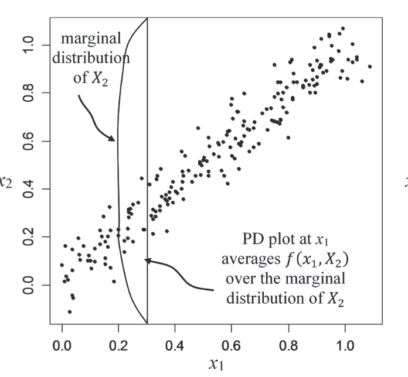
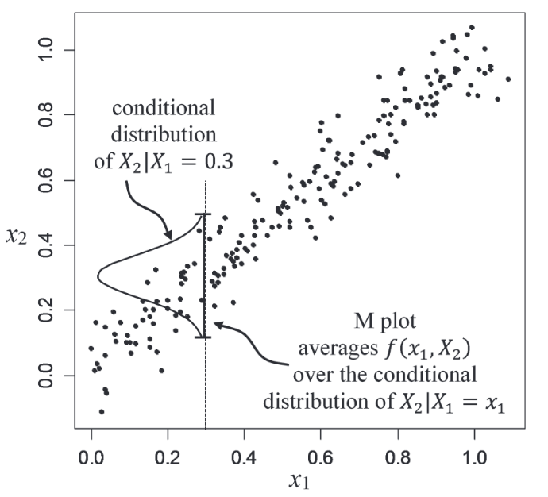
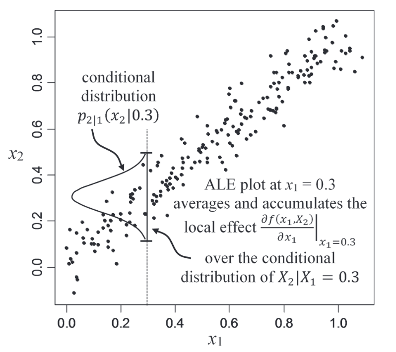
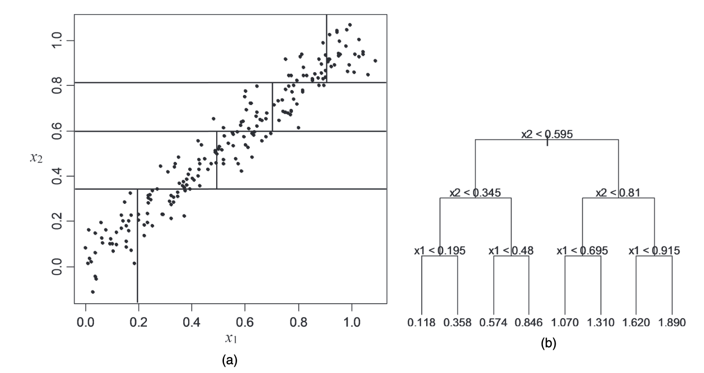
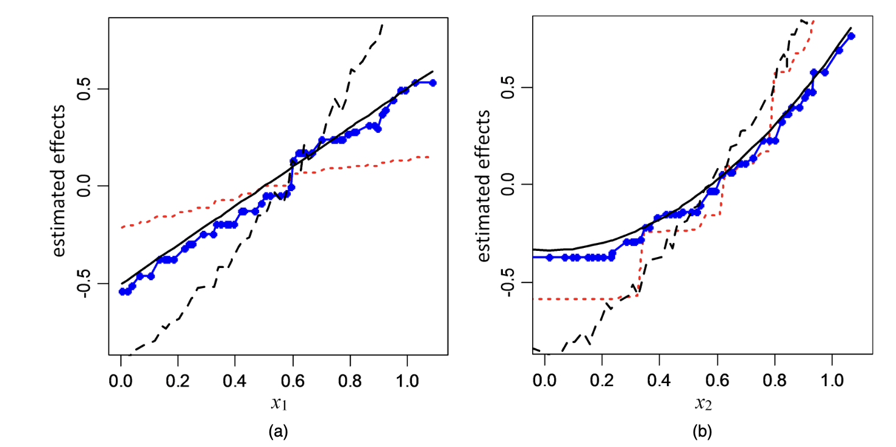
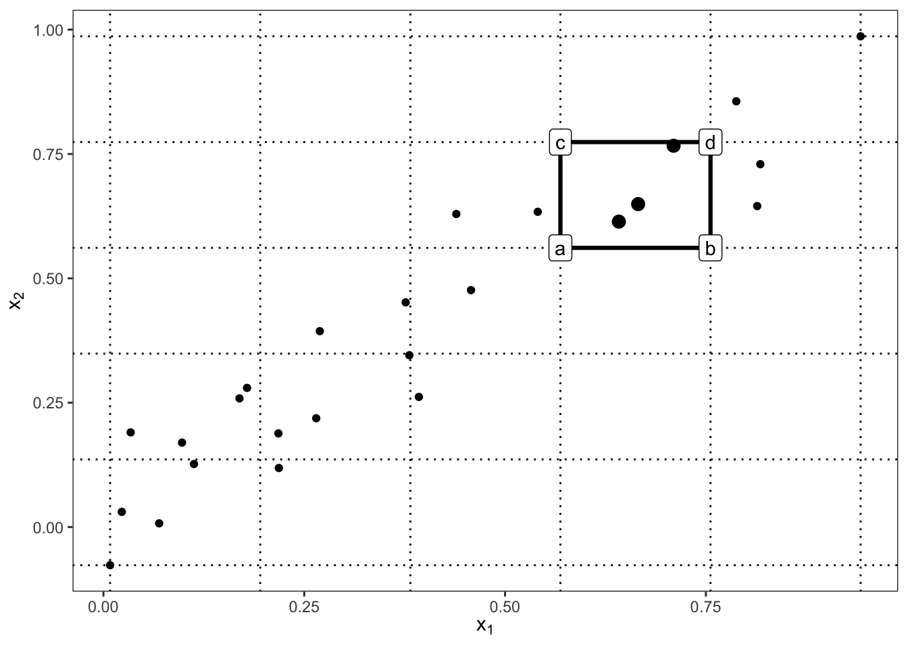

Modern machine learning models can produce accurate predictions while being difficult to interpret. Accumulated Local Effects (ALE) is a model agnostic interpretation method designed to answer the question: 

> *How does a particular feature influence the model's predictions?*

Its goal is to summarize how the prediction of a fitted model changes as one feature changes, while accounting for the dependence between features. ALE plots are similar to Partial Dependence Plots (PDPs), but they are more robust to correlated features and can provide more accurate interpretations in such cases.

## Motivation

### Partial Dependence

For simplicity, first consider the two-dimensional case $\mathbf X=(X_1, X_2)$. The partial dependence function of $X_1$ is defined as:

$$
f_{1, \PD}(x_1) = \E[f(x_1, X_2)] = \int p_2(x_2) f(x_1,x_2)dx_2
$${#eq-pd}

where $p_2(x_2)$ is the marginal distribution of $X_2$. Given observations $\{x_i=(x_{i,1}, x_{i,2}): i=1, \ldots, n\}$, the estimate of @eq-pd is given by 

$$
\hat f_{1, \PD(x_1)} = \frac{1}{n} \sum_{i=1}^n f(x_1, x_{i,2})
$$

{#fig-pd-a}

@fig-pd-a illustrate the weakness of PD. @apleyVisualizingEffectsPredictor2020 construct dependent predictors lying approximately along a line. The PD function is estimated by averaging the predictions over the marginal distribution of $X_2$. However, this can lead to unrealistic combinations of features that do not occur in the data, resulting in misleading interpretations.

### Marginal Effects

An alternative approach is to replace the marginal density by the conditional density. We define the marginal-plot function:

$$
f_{1, M}(x_1) = \E[f(x_1, X_2)|X_1=x_1] = \int p_{2|1}(x_2|x_1) f(x_1,x_2)dx_2.
$${#eq-marginal}

An estimate of @eq-marginal is given by

$$
\hat f_{1, M}(x_1) = \frac{1}{n(x_1)}\sum_{i\in N(x_1)} f(x_1, x_{i,2})
$$

where $N(x_1)\subset \{1, \ldots, n\}$ is the subset of row indices $i$ for which $x_{i, 1}$ is close to $x_1$, and $n(x_1)$ is the number of such rows.

{#fig-pd-b}

@fig-pd-b shows that this keeps the evaluation close to the observed data cloud. However, the M-plot is like regressing $Y$ on $X_1$ while ignoring $X_2$. If both predictors affect the response and the predictors are dependent, then the apparent effect of $X_1$ includes some of the effect of $X_2$. This is called __omitted variable bias__ and can lead to misleading interpretations.

## Accumulated Local Effects (ALE)

The central idea of ALE is to work with _local changes of the fitted function_ rather than prediction levels. For two predictors and a differentiable fitted function, @apleyVisualizingEffectsPredictor2020 first introduce

$$
f^{1}(x_1, x_2) = \frac{\partial f(x_1, x_2)}{\partial x_1}
$$

This is the local effect of $X_1$ on the prediction at $(x_1, x_2)$. The ALE function is defined as

$$
\begin{aligned}
f_{1, \ALE}(x_1) &= \int_{x_{\min, 1}}^{x_1} \E[f^{1}(x_1, X_2)|X_1=z_1] dz_1 - \text{constant} \\
&= \int_{x_{\min, 1}}^{x_1} \int p_{2|1}(x_2|z_1) f^{1}(z_1,x_2)dx_2 dz_1 - \text{constant}
\end{aligned}
$${#eq-ale}

where $x_{\min, 1}$ is some value chosen near the lower bound of the effective support of $p_1(\cdot)$. This construction can be explained in three stages. First, calculate the local effect $f^{1}(x_1, x_2)$ at each observation $(x_{i,1}, x_{i,2})$. Second, average these local effects over the conditional distribution of $X_2$ given $X_1=x_1$. Third, integrate the averaged local effects over $x_1$ to obtain the ALE function. 

{#fig-ale}

@fig-ale visualizes the computation of $f_{1, \ALE}(x_1)$ at $x_1=0.3$. Instead of evaluating $f$ over an entire vertical line as PD does, ALE works with local changes near points supported by the conditional distribution. 

### Uncertered ALE main effect

@eq-ale assumes differentiability, while models such as trees are not differentiable. 

We assume that $\mathbf{X}$ is continuous and has compact support $\mathcal{S}$, and let the support of $X_j$ be interval $\mathcal S_j=[x_{\min,j}, x_{\max,j}]$ for each $j\in \{1, 2, \ldots, d\}$. For a partition with $K$ intervals, we write 

$$
\mathcal P_{j}^{K} \coloneqq \{z_{k, j}^K: k=0, 1, \ldots, K\}
$$

where $z_{0, j}^K=x_{\min,j}$ and $z_{K, j}^K=x_{\max,j}$. We then define the fineness of the partition by 

$$
\delta_{j, K} \coloneqq \max \{ |z_{k, j}^K - z_{k-1, j}^K|: k=1, 2, \ldots, K \}
$$

As $K\to \infty$, we have $\delta_{j, K}\to 0$. Let $X_{\\ j}$ denote all predictors except $X_j$.


::: {#def-uncentered-ale}

## Uncentered ALE main effect

Provided the limit exists and is independent of the particular sequence of partitions, the uncentered ALE main (which is also known as the first-order) effect of $X_j$ is defined as

$$
g_{j, \ALE}(x_j) \coloneqq \lim_{K\to \infty} \sum_{k=1}^{k_j^K (x_j)} \E\left[f(z_{k,j}^K, \mathbf{X}_{\\ j})- f(z_{k-1,j}^K, \mathbf{X}_{\\ j})\mid X_j \in (z_{k-1,j}^K, z_{k,j}^K)\right]
$${#eq-ale-uncentered-theory}

:::

@apleyVisualizingEffectsPredictor2020 then show that the finite-difference definition can be reduced to the derivative representation under regularity conditions.

::: {#thm-ale-derivative}

## Uncentered ALE Main Effect for differentiable $f$

Let $f^{j}(x_j, \mathbf{x}_{\\ j}) \coloneqq \frac{\partial f(x_j, \mathbf{x}_{\\ j})}{\partial x_j}$ denote the partial derivative of $f$ with respect to $x_j$ when it exists. In @def-uncentered-ale, suppose that

1. $f$ is differentiable in $x_j$ on $\mathcal S$,
2. $f^{j}$ is continuous in $(x_j, \mathbf {x}_{\\ j})$ on $\mathcal S$, and
3. $\E[f^j(X_j, \mathbf{X}_{\\ j})\mid X_j=z_j]$ is continuous in $z_j$ on $\mathcal S_j$.

Then, for each $x_j \in \mathcal S_j$,

$$
g_{j, \ALE}(x_j) = \int_{x_{\min,j}}^{x_j} \E[f^j(X_j, \mathbf{X}_{\\ j})\mid X_j=z_j] dz_j
$$

:::
At first glance, $\int \frac{\partial f(x_j, \mathbf{x}_{\\ j})}{\partial x_j} dz_j$ may seem to be equal to $f(x_j, \mathbf{x}_{\\ j})$. However, this is not the case because the integral is taken with respect to $z_j$, while the partial derivative is taken with respect to $x_j$. Consequently, differentiation first isolates the local effect of $X_j$, conditional averaging restricts the calculation to the observed data cloud, and integration reconstructs the cumulative across the range of $X_j$. 

We can also define the (centered) ALE main effect of $X_j$, which is denoted by $f_{j, \ALE}(x_j)$ and is obtained by centering the uncentered ALE main effect:

$$
\begin{aligned}
f_{j, \ALE}(x_j) &\coloneqq g_{j, \ALE}(x_j) - \E[g_{j, \ALE}(X_j)]\\
& = g_{j, \ALE}(x_j) - \int p_j(z_j)g_{j, \ALE}(z_j) dz_j
\end{aligned}
$$

### Additive recovery property

Suppose $f(x) = \sum_{j=1}^d f_j(x_j)$ is an additive function. Then, both ALE and PD recover the true component $f_j(x_j)$ up to an additive constant:

$$
f_{j, \ALE}(x_j) = f_j(x_j) + C_j.
$$

Thus, when the fitted prediction function is additive, the ALE main-effect curve recovers the individual predictor effect regardless of how black-box the model is. However, if the fitted function is not additive, then the ALE main effect is not equal to the true component $f_j(x_j)$, but it still provides a useful summary of the effect of $X_j$ on the prediction.

## Estimating and Construction of an ALE Plot

In practice, ALE plots are estimated from a fintie dataset. To be summarized, this can be done by replacing the infinite sequence of increasingly fine partitions by a fixed partition and replace the conditional expectation by sample averages.

Suppose $X_j$ is divided into $K$ intervals $(z_{0,j}, z_{1,j}], (z_{1,j}, z_{2,j}], \ldots, (z_{K-1,j}, z_{K,j}]$. Let $N_j(k)=(z_{k-1,j}, z_{k,j}]$ be a fine partition of the sample range of $X_j$. 

For every observation $i\in N_j(k)$, we then evaluate the fitted model $f(z_{k, j}, \mathbf x_{i,\\j})$ and $f(z_{k-1, j}, \mathbf x_{i, \\j})$ and compute the difference

$$
\Delta_{i,k} = f(z_{k, j}, \mathbf x_{i, \\j}) - f(z_{k-1, j}, \mathbf x_{i, \\j})
$$

This can be interpreted as 

> For observation $i$, how much does the fitted prediction change when $X_j$ moves across interval $k$, with all remaining predictors fixed at their observed values?

The local average effect is then 

$$
\overline \Delta_k = \frac{1}{n_j(k)} \sum_{\{i: x_{i,j} \in N_j(k)\}} \Delta_{i,k}
$$

### Accumulation 

For a value $x_j$ falling in interval $k_j(x_j)$, the estimated uncertered ALE is

$$
\hat g_{j, \ALE}(x_j) = \sum_{k=1}^{k_j(x_j)}\frac{1}{n_j(k)} \sum_{\{i: x_{i,j} \in N_j(k)\}} \{f(z_{k, j}, \mathbf x_{i, \\j}) - f(z_{k-1, j}, \mathbf x_{i, \\j})\}
$${#eq-ale-uncentered}

So the procedure is therefore:

$$
\boxed{
    \text{partition} \to \text{difference} \to \text{local average} \to \text{accumulation}
}
$$

Centering is then applied to obtain the estimated ALE main effect:

$$
\hat f_{j, \ALE}(x_j) = \hat g_{j, \ALE}(x_j) - \frac{1}{n} \sum_{i=1}^n \hat g_{j, \ALE}(x_{i,j})
$$

::: {#thm-ale-consistent}

## Consistency of the ALE main effect estimator

Consider a sequence of partitions $\{\mathcal P_j^K: K=1, 2, \ldots\}$ as in @def-uncentered-ale such that $\delta_{j, K}\to 0$ as $K\to \infty$. Denote the estimator (@eq-ale-uncentered) of the uncentered ALE main effect of $X_j$ using partition $\mathcal P_j^K$ and sample size $n$ by 

$$
\hat g_{j, \ALE, K, n}(x) = \sum_{k=1}^{k_j^K(x)} \frac{\sum_{i=1}^n \mathbb{I}(X_{i,j} \in (z_{k-1,j}, z_{k,j}])[f(z_{k, j}, \mathbf x_{i, \\j}) - f(z_{k-1, j}, \mathbf x_{i, \\j})]}{\sum_{i=1}^n \mathbb{I}(X_{i,j} \in (z_{k-1,j}, z_{k,j}])}
$$

where $\mathbb{I}(\cdot)$ denotes the indicator function of an event. Assume that $\{\mathbf{X}_i: i=1,2, \ldots\}$ is an i.i.d. sequence of random vectors drawn from $p(\cdot)$, and let $P$ denote the probability measure on the underlying probability space of this random sequence. Let

$$
g_{j, \ALE, K}(x) = \sum_{k=1}^{k_j^K(x)} \E[f(z_{k, j}, \mathbf X_{\\j}) - f(z_{k-1, j}, \mathbf X_{\\j})\mid X_j \in (z_{k-1,j}, z_{k,j}]]
$$

denote the finite-$K$ version of $g_{j, \ALE}(x)$ in @eq-ale-uncentered-theory using the same partition $\mathcal P_j^K$ as the estimator. Then $\hat g_{j, \ALE, K, n}(x)$ is a strongly consistent estimator of $g_{j, \ALE, K}(x)$ in the following sense. For each $x\in \mathcal S_j$, each $\epsilon>0$, and each $K$, 

$$
\lim_{n\to \infty} \hat{g}_{j, \ALE, K, n}(x) = g_{j, \ALE, K}(x) \quad a.s. -P
$$

with $|g_{j, \ALE, K}(x) - g_{j, \ALE}(x)| < \epsilon$ if $K$ is sufficiently large.

Moreover, there exists a sequence of sample size $\{n_K: K=1, 2, \ldots\}$ such that, as $K\to \infty$, $\hat g_{j, \ALE, K, n_K}(x) \to g_{j, \ALE}(x)$ both in probability and in mean.

:::

The importance of this result is that <span style="color:purple">the ALE main effect estimator is consistent, meaning that as the sample size increases and the partition becomes finer, the estimated ALE main effect converges to the true ALE main effect.</span> This provides a theoretical guarantee for the reliability of ALE plots in practice.

### Interval width and stability

If $K$ is too small, intervals are wide and the differences are not local.

If $K$ is too large, each interval contains relatively few observations and the estimated conditional averages can become noisy. Thus, the choice of $K$ is a trade-off between bias and variance. Quantile partitions help by keeping roughly similar numbers of observations in each interval, but for a strong skewed predictors, quantile intervals may have very different widths.

## Reading an ALE Plot

### Interpreting the ordinate

Because the ALE main effect is centered, $\E[\hat f_{j, \ALE}(X_j)] = 0$. Suppose $f_{j, \ALE}(x_j)=-2$. The interpretation is that the main effect associated with $X_j=x_j$ lowers the model prediction by approximately 2 response units relative to the predictor's average main effect @molnarInterpretableMachineLearning. A value of zero means that the accumulated effect at that predictor value is at the centered average reference level.

### Interpreting the slope

The local behavior of the curve is often more informative than its absolute height. If 

$$
\frac{\partial f_{j, \ALE}(x_j)}{\partial x_j} > 0
$$

then the fitted prediction tends to increase as $X_j$ increase in that region, and vice versa. 

{#fig-tree-plot-apley}

{#fig-tree-pd-ale-m-apley}

## Second Order ALE Effects

Let $X_j$ and $X_l$ be two predictors. We define $\mathbf{X}_{\\ j, l}$ to be all remaining predictors.

::: {#def-uncentered-ale-second-order}

## Uncentered ALE second-order effect

Consider any pair $\{j, l\}\subseteq \{1, \ldots, d\}$ and corresponding sequences of partitions $\{\mathcal P_j^K: K=1, 2, \ldots\}$ and $\{\mathcal P_l^K: K=1, 2, \ldots\}$  such that $\lim_{K\to \infty} \delta_{j, K} = \lim_{K\to \infty} \delta_{l, K} = 0$. When $f(\cdot)$ and $p$ are such that the following limit exists and is independent of the particular sequences of partitions, we define the uncentered ALE second-order effect function of $(X_j, X_l)$ as (for $(x_j, x_l)\in \mathcal S_j\times \mathcal S_l$)

$$
\scriptsize
h_{\{j, l\}, \ALE}(x_j, x_l) \coloneqq \lim_{K\to \infty} \sum_{k=1}^{k_j^K(x_j)} \sum_{m=1}^{k_l^K(x_l)} \E\left[\Delta_{f}^{\{j, l\}}(K, k, m; \mathbf{X}_{\\ j, l})\mid X_j \in (z_{k-1,j}^K, z_{k,j}^K], X_l \in (z_{m-1,l}^K, z_{m,l}^K]\right]
$$

where

$$
\scriptsize
\Delta_{f}^{\{j, l\}}(K, k, m; \mathbf{x}_{\\ j, l}) = [f(z_{k,j}^K, z_{m,l}^K, \mathbf{x}_{\\ j, l}) - f(z_{k-1,j}^K, z_{m,l}^K, \mathbf{x}_{\\ j, l}) ] - [f(z_{k,j}^K, z_{m-1,l}^K, \mathbf{x}_{\\ j, l}) - f(z_{k-1,j}^K, z_{m-1,l}^K, \mathbf{x}_{\\ j, l}) ]
$$

is the second-order finite difference of $f(\mathbf x)=f(x_j, x_l, \mathbf x_{\\\{j, l\}})$ with respect to $(x_j, x_l)$ across cell $(z_{k-1,j}^K, z_{k,j}^K]\times (z_{m-1,l}^K, z_{m,l}^K]$ of the 2-D grid that is the Cartesian product of $\mathcal P_j^K$ and $\mathcal P_l^K$.

:::

This looks like a jump-scare. For a simple understanding, consider a rectangular cell with $X_j$-boundaries $(z_{k-1,j}^K, z_{k,j}^K]$ and $X_l$-boundaries $(z_{m-1,l}^K, z_{m,l}^K]$. The second-order finite difference $\Delta_{f}^{\{j, l\}}(K, k, m; \mathbf{x}_{\\ j, l})$ is the difference between the two first-order finite differences of $f(\mathbf x)$ with respect to $x_j$ at the two $X_l$-boundaries of the cell. It measures how much the effect of $X_j$ on the prediction changes as $X_l$ moves across its interval, and vice versa.

{#fig-aleplot-computation-2d-1}

## Simulation Studies

The theory above gives us the recipe. The simulation below turns that recipe into a small modular workflow:

1. Generate data from a known nonlinear regression function.
2. Fit either a random forest or a spline regression.
3. Estimate PD, M, and ALE curves from the fitted model.
4. Compare each estimated curve with the known centered main effect.

Keeping each step in a function makes the rest of the story easier to extend. After the first single-sample demonstration, we reuse the same functions to vary the sample size and then to run many independent replications.

```{python}
import numpy as np
import pandas as pd
import matplotlib.pyplot as plt

from sklearn.ensemble import RandomForestRegressor
from sklearn.linear_model import LinearRegression
from sklearn.preprocessing import SplineTransformer

RANDOM_SEED = 6400
BASE_N = 100
CORRELATED_RHO = 0.8
SAMPLE_SIZE_GRID = [100, 250, 500, 1000, 2500, 5000]
EFFECT_GRID = np.linspace(-2.326, 2.326, 100)
FEATURES = ("X1", "X2")
MODEL_TYPES = ("rf", "spline")


def sigmoid(x):
    return 1 / (1 + np.exp(-x))


def simulate_data(n, rho=0.0, seed=RANDOM_SEED):
    """Generate one dataset from the known data-generating mechanism."""
    rng = np.random.default_rng(seed)

    if rho == 0:
        x1 = rng.normal(0, 1, n)
        x2 = rng.normal(0, 1, n)
    else:
        cov_matrix = [[1, rho], [rho, 1]]
        x1, x2 = rng.multivariate_normal(mean=[0, 0], cov=cov_matrix, size=n).T

    x3 = rng.binomial(1, 0.4, n)
    mu = np.sqrt(5) * sigmoid(x1 + x3) + np.sqrt(5) * sigmoid(x2) * x3
    y = mu + rng.normal(0, 1, n)
    x = pd.DataFrame({"X1": x1, "X2": x2, "X3": x3})
    return x, y


X, Y = simulate_data(BASE_N, rho=0.0, seed=RANDOM_SEED)

print(X.head())
print(Y[:5])
```

The conditional mean used in the simulation is

$$
\mu(X)=\sqrt{5}\,\sigma(X_1+X_3)+\sqrt{5}\,\sigma(X_2)X_3,
$$

where $\sigma(t)=1/(1+\exp(-t))$. Since $X_3\sim \text{Bernoulli}(0.4)$ is independent of $X_1$ and $X_2$, the true centered main effects for $X_1$ and $X_2$ are known. That gives us a reference curve for judging the fitted PD, M, and ALE curves.

Next we define two model-fitting functions. Each one returns a small bundle containing the fitted model name and a prediction function. This avoids relying on global model objects and lets the same plotting code work for either model.

```{python}
def fit_random_forest(X, y, seed=RANDOM_SEED):
    model = RandomForestRegressor(
        n_estimators=300,
        min_samples_leaf=10,
        random_state=seed,
        n_jobs=-1,
    )
    model.fit(X, y)

    def predict(X_new):
        return model.predict(X_new)

    return {"name": "Random Forest", "predict": predict, "model": model}


def fit_spline_regression(X, y):
    spline = SplineTransformer(n_knots=6, degree=3, include_bias=False)
    basis = spline.fit_transform(X[["X1", "X2"]])
    n_basis = basis.shape[1] // 2

    b1 = basis[:, :n_basis]
    b2 = basis[:, n_basis:]
    x3 = X["X3"].to_numpy().reshape(-1, 1)
    design = np.hstack([b1, b2, x3, b1 * x3, b2 * x3])

    model = LinearRegression()
    model.fit(design, y)

    def predict(X_new):
        basis_new = spline.transform(X_new[["X1", "X2"]])
        b1_new = basis_new[:, :n_basis]
        b2_new = basis_new[:, n_basis:]
        x3_new = X_new["X3"].to_numpy().reshape(-1, 1)
        design_new = np.column_stack(
            [b1_new, b2_new, x3_new, b1_new * x3_new, b2_new * x3_new]
        )
        return model.predict(design_new)

    return {"name": "Spline Regression", "predict": predict, "model": model}


def fit_model(X, y, model_type, seed=RANDOM_SEED):
    if model_type == "rf":
        return fit_random_forest(X, y, seed=seed)
    if model_type == "spline":
        return fit_spline_regression(X, y)
    raise ValueError("model_type must be 'rf' or 'spline'")
```

> **Partial Dependence**

For feature $X_j$, the partial dependence function is defined as:

$$
f_{j, \PD}(x_j) = \E[f(x_j, \mathbf{X}_{\\ j})]
$$

Empirically, we can estimate this by averaging the predictions over the marginal distribution of $\mathbf{X}_{\\ j}$:

$$
\hat f_{j, \PD}(x_j) = \frac{1}{n} \sum_{i=1}^n f(x_j, \mathbf{x}_{i, \\ j})
$$

So for every grid value $x$, we replace the feature for all observations by $x$.

```{python}
def partial_dependence(predict, X, feature, grid):
    values = []
    for x in grid:
        X_temp = X.copy()
        X_temp[feature] = x
        values.append(predict(X_temp).mean())
    return np.array(values)
```

> **M-Plot**

The M-plot uses the conditional distribution:

$$
f_{j, M}(x) = \E[f(X_j, \mathbf{X}_{\\ j}) | X_j = x]
$$

In practice we cannot condition on exactly $X_j=x$ for a continuous variable, so we use observations near $x$.

```{python}
def m_plot(predict, X, feature, grid, neighborhood_fraction=0.10):
    values = []
    n_neighbors = max(1, int(neighborhood_fraction * len(X)))
    feature_values = X[feature].to_numpy()

    for x in grid:
        distance = np.abs(feature_values - x)
        nearest_idx = np.argsort(distance)[:n_neighbors]
        X_local = X.iloc[nearest_idx].copy()
        X_local[feature] = x
        values.append(predict(X_local).mean())
    return np.array(values)
```

> **ALE Plot**

Now we implement 1D ALE. For interval $(z_{k-1}, z_{k}]$, we use observations in that interval to compute $f(z_{k}, \mathbf{x}_{i, \\ j}) - f(z_{k-1}, \mathbf{x}_{i, \\ j})$ and average them. Then we accumulate these averages to get the ALE function:

$$
\hat g_{j, \ALE}(x_j) = \sum_{k=1}^{k_j(x_j)}\frac{1}{n_j(k)} \sum_{\{i: x_{i,j} \in N_j(k)\}} \{f(z_{k, j}, \mathbf x_{i, \\j}) - f(z_{k-1, j}, \mathbf x_{i, \\j})\}
$$

```{python}
def ale_1d(predict, X, feature, n_bins=20):
    x = X[feature].to_numpy()
    edges = np.quantile(x, np.linspace(0, 1, n_bins + 1))
    edges = np.unique(edges)

    local_effects = []
    bin_centers = []
    bin_counts = []

    for k in range(1, len(edges)):
        lower = edges[k - 1]
        upper = edges[k]
        if k == 1:
            mask = (x >= lower) & (x <= upper)
        else:
            mask = (x > lower) & (x <= upper)

        X_bin = X[mask].copy()
        if len(X_bin) == 0:
            continue

        X_lower = X_bin.copy()
        X_lower[feature] = lower
        X_upper = X_bin.copy()
        X_upper[feature] = upper

        difference = predict(X_upper) - predict(X_lower)
        local_effects.append(difference.mean())
        bin_centers.append((lower + upper) / 2)
        bin_counts.append(len(X_bin))

    local_effects = np.array(local_effects)
    bin_centers = np.array(bin_centers)
    bin_counts = np.array(bin_counts)

    ale = np.cumsum(local_effects)
    weighted_mean = np.average(ale, weights=bin_counts)
    ale = ale - weighted_mean
    return bin_centers, ale
```

ALE is centered so that $\E[\hat f_{j, \ALE}(X_j)] = 0$. PD and M-plots, however, are displayed on the prediction scale. If we draw them together, differences in vertical position would reflect differences in the average prediction of the model, which is not the goal. To make them comparable, we center PD and M-plots by subtracting their mean.

```{python}
def center_curve(values):
    return values - np.mean(values)
```

To make the true curve stable across replications, we center it using a large reference sample from the marginal $N(0, 1)$ distribution of each continuous predictor.

```{python}
TRUE_CENTER_REFERENCE = np.random.default_rng(2024).normal(0, 1, 200_000)


def raw_true_effect(feature, x):
    if feature == "X1":
        return np.sqrt(5) * (0.6 * sigmoid(x) + 0.4 * sigmoid(x + 1))
    if feature == "X2":
        return 0.4 * np.sqrt(5) * sigmoid(x)
    raise ValueError("feature must be 'X1' or 'X2'")


def true_effect(feature, grid, center="population", X=None):
    effect = raw_true_effect(feature, grid)

    if center == "population":
        reference_effect = raw_true_effect(feature, TRUE_CENTER_REFERENCE)
    elif center == "sample":
        if X is None:
            raise ValueError("X must be supplied when center='sample'")
        reference_effect = raw_true_effect(feature, X[feature].to_numpy())
    else:
        raise ValueError("center must be 'population' or 'sample'")

    return effect - np.mean(reference_effect)
```

The next function computes all four curves on a shared grid. ALE is naturally estimated at bin centers, so for visual comparison and replication summaries we interpolate it back onto the same display grid used by PD and M.

```{python}
def compute_effects(model_bundle, X, feature, grid=EFFECT_GRID, n_bins=20):
    predict = model_bundle["predict"]

    pd_values = center_curve(partial_dependence(predict, X, feature, grid))
    m_values = center_curve(m_plot(predict, X, feature, grid))
    ale_x, ale_values = ale_1d(predict, X, feature, n_bins=n_bins)
    if len(ale_values) == 0:
        raise ValueError(f"ALE could not be estimated for {feature}; check the binning.")
    ale_on_grid = np.interp(grid, ale_x, ale_values, left=ale_values[0], right=ale_values[-1])
    true_values = true_effect(feature, grid, center="population")

    return pd.DataFrame(
        {
            "x": np.tile(grid, 4),
            "curve": np.repeat(["PD", "M", "ALE", "True"], len(grid)),
            "effect": np.concatenate([pd_values, m_values, ale_on_grid, true_values]),
            "feature": feature,
            "model": model_bundle["name"],
        }
    )


def run_one_simulation(n=BASE_N, rho=0.0, seed=RANDOM_SEED, model_types=MODEL_TYPES):
    X, y = simulate_data(n=n, rho=rho, seed=seed)
    results = []

    for model_type in model_types:
        model_bundle = fit_model(X, y, model_type=model_type, seed=seed)
        for feature in FEATURES:
            results.append(compute_effects(model_bundle, X, feature))

    curves = pd.concat(results, ignore_index=True)
    curves["n"] = n
    curves["rho"] = rho
    curves["seed"] = seed
    return curves, X, y
```

Now we can compute them for both continuous variables $X_1$ and $X_2$ for both models.

```{python}
independent_curves, X_independent, Y_independent = run_one_simulation(
    n=BASE_N,
    rho=0.0,
    seed=RANDOM_SEED,
)
```

The plotting function is also modular. It accepts the tidy curve data returned by `run_one_simulation()`, so the same function can be reused for the independent, correlated, sample-size, and replication-band simulations.

```{python}
CURVE_STYLES = {
    "PD": {"linestyle": "-", "linewidth": 1.8},
    "M": {"linestyle": "-", "linewidth": 1.8},
    "ALE": {"linestyle": "-", "linewidth": 1.8},
    "True": {"linestyle": "--", "linewidth": 2.2, "color": "black"},
}


def plot_effect_panel(curves, title):
    models = curves["model"].unique()
    features = curves["feature"].unique()
    fig, axes = plt.subplots(
        len(models),
        len(features),
        figsize=(6 * len(features), 4.2 * len(models)),
        squeeze=False,
        sharey=False,
    )

    for row, model_name in enumerate(models):
        for col, feature in enumerate(features):
            ax = axes[row, col]
            subset = curves[(curves["model"] == model_name) & (curves["feature"] == feature)]

            for curve_name, curve_df in subset.groupby("curve", sort=False):
                style = CURVE_STYLES.get(curve_name, {})
                ax.plot(curve_df["x"], curve_df["effect"], label=curve_name, **style)

            ax.axhline(0, color="gray", linewidth=0.8)
            ax.set_title(f"{model_name}: {feature}")
            ax.set_xlabel(feature)
            if col == 0:
                ax.set_ylabel("Centered effect")
            ax.legend()

    fig.suptitle(title, y=1.02)
    plt.tight_layout()
    plt.show()
```

```{python}
plot_effect_panel(independent_curves, "Independent predictors")
```

Because the $X_1$, $X_2$ and $X_3$ are independent, we cannot see the PD-M-ALE differences. Let's introduce correlation between $X_1$ and $X_2$ to see the differences.

```{python}
correlated_curves, X_correlated, Y_correlated = run_one_simulation(
    n=BASE_N,
    rho=CORRELATED_RHO,
    seed=RANDOM_SEED + 1,
)
```

It is useful to visualize the correlation between $X_1$ and $X_2$.

```{python}
plt.figure(figsize=(7, 5))
plt.scatter(X_correlated["X1"], X_correlated["X2"], alpha=0.5)
plt.xlabel("X1")
plt.ylabel("X2")
plt.title("Correlation between X1 and X2")
plt.show()
```

And now we can plot the results again.

```{python}
plot_effect_panel(correlated_curves, "Correlated predictors")
```

### What changes as \(n\) grows?

The single correlated sample tells one story, but it does not show whether the curves are stable. We next reuse the same pipeline over a grid of sample sizes from \(n=100\) to \(n=5000\). Each panel uses one simulated dataset at that sample size, so the point is visual: small \(n\) curves fluctuate more, while large \(n\) curves should settle toward their population targets.

```{python}
def run_sample_size_grid(
    sample_sizes=SAMPLE_SIZE_GRID,
    rho=CORRELATED_RHO,
    base_seed=RANDOM_SEED + 100,
    model_types=MODEL_TYPES,
):
    results = []

    for offset, n in enumerate(sample_sizes):
        curves, _, _ = run_one_simulation(
            n=n,
            rho=rho,
            seed=base_seed + offset,
            model_types=model_types,
        )
        results.append(curves)

    return pd.concat(results, ignore_index=True)


def plot_sample_size_grid(curves, model_name, feature, curves_to_show=("PD", "M", "ALE", "True")):
    sample_sizes = sorted(curves["n"].unique())
    n_cols = 3
    n_rows = int(np.ceil(len(sample_sizes) / n_cols))
    fig, axes = plt.subplots(
        n_rows,
        n_cols,
        figsize=(5.2 * n_cols, 3.6 * n_rows),
        sharex=True,
        sharey=False,
    )
    axes = np.array(axes).reshape(-1)

    for ax, n in zip(axes, sample_sizes):
        subset = curves[
            (curves["model"] == model_name)
            & (curves["feature"] == feature)
            & (curves["n"] == n)
            & (curves["curve"].isin(curves_to_show))
        ]

        for curve_name, curve_df in subset.groupby("curve", sort=False):
            style = CURVE_STYLES.get(curve_name, {})
            ax.plot(curve_df["x"], curve_df["effect"], label=curve_name, **style)

        ax.axhline(0, color="gray", linewidth=0.8)
        ax.set_title(f"n = {n}")
        ax.set_xlabel(feature)

    for ax in axes[len(sample_sizes):]:
        ax.axis("off")

    axes[0].set_ylabel("Centered effect")
    axes[0].legend()
    fig.suptitle(f"{model_name}: {feature} as sample size grows", y=1.02)
    plt.tight_layout()
    plt.show()
```

```{python}
n_grid_curves = run_sample_size_grid()

plot_sample_size_grid(n_grid_curves, "Random Forest", "X1")
plot_sample_size_grid(n_grid_curves, "Random Forest", "X2")
plot_sample_size_grid(n_grid_curves, "Spline Regression", "X1")
plot_sample_size_grid(n_grid_curves, "Spline Regression", "X2")
```

### Replication bands

The sample-size grid still uses only one dataset per \(n\). To ask whether a curve is reliably close to the true effect, we need repeated datasets. The function below runs independent replications, stores the PD, M, ALE, and true curves on the same grid, and then summarizes the empirical distribution of each estimated curve at each grid point.

```{python}
def run_replication_study(
    n,
    replications=1000,
    rho=CORRELATED_RHO,
    base_seed=RANDOM_SEED + 10_000,
    model_types=MODEL_TYPES,
):
    results = []

    for replication in range(replications):
        curves, _, _ = run_one_simulation(
            n=n,
            rho=rho,
            seed=base_seed + replication,
            model_types=model_types,
        )
        curves["replication"] = replication + 1
        results.append(curves)

    return pd.concat(results, ignore_index=True)


def summarize_replication_bands(replication_curves, alpha=0.10):
    estimated = replication_curves[replication_curves["curve"] != "True"]
    grouped = estimated.groupby(["model", "feature", "curve", "x"])["effect"]

    bands = grouped.quantile([alpha / 2, 0.5, 1 - alpha / 2]).unstack()
    bands = bands.rename(columns={alpha / 2: "lower", 0.5: "median", 1 - alpha / 2: "upper"})
    bands = bands.reset_index()

    bands["true"] = np.nan
    for feature in bands["feature"].unique():
        mask = bands["feature"] == feature
        bands.loc[mask, "true"] = true_effect(
            feature,
            bands.loc[mask, "x"].to_numpy(),
            center="population",
        )

    bands["contains_true"] = (bands["lower"] <= bands["true"]) & (bands["true"] <= bands["upper"])

    coverage = (
        bands.groupby(["model", "feature", "curve"])["contains_true"]
        .mean()
        .reset_index(name="pointwise_grid_coverage")
    )
    return bands, coverage


def plot_replication_bands(bands, model_name, feature):
    subset = bands[(bands["model"] == model_name) & (bands["feature"] == feature)]
    curves = ["PD", "M", "ALE"]
    fig, axes = plt.subplots(len(curves), 1, figsize=(8, 9), sharex=True, sharey=False)

    for ax, curve_name in zip(axes, curves):
        curve_df = subset[subset["curve"] == curve_name].sort_values("x")
        ax.fill_between(
            curve_df["x"],
            curve_df["lower"],
            curve_df["upper"],
            alpha=0.25,
            label="Middle 90% of replications",
        )
        ax.plot(curve_df["x"], curve_df["median"], label=f"Median {curve_name}")
        ax.plot(curve_df["x"], curve_df["true"], color="black", linestyle="--", label="True")
        ax.axhline(0, color="gray", linewidth=0.8)
        ax.set_title(curve_name)
        ax.set_ylabel("Centered effect")
        ax.legend()

    axes[-1].set_xlabel(feature)
    fig.suptitle(f"{model_name}: replication bands for {feature}", y=1.02)
    plt.tight_layout()
    plt.show()
```


```{python}
#| eval: false
replication_curves = run_replication_study(
    n=1000,
    replications=1000,
    rho=CORRELATED_RHO,
    model_types=MODEL_TYPES,
)

replication_bands, replication_coverage = summarize_replication_bands(replication_curves)
display(replication_coverage)

plot_replication_bands(replication_bands, "Random Forest", "X1")
plot_replication_bands(replication_bands, "Random Forest", "X2")
plot_replication_bands(replication_bands, "Spline Regression", "X1")
plot_replication_bands(replication_bands, "Spline Regression", "X2")
```
