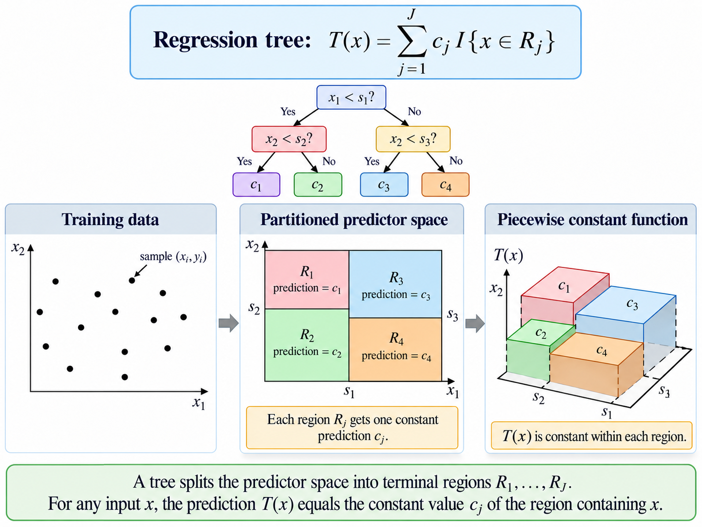
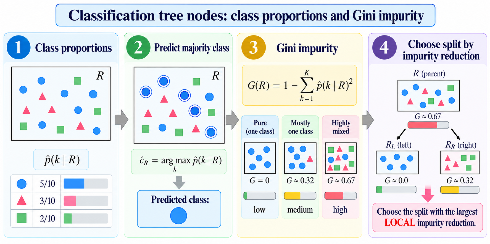
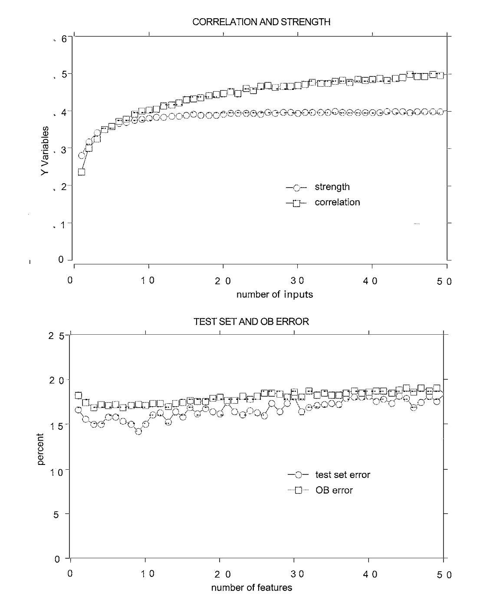
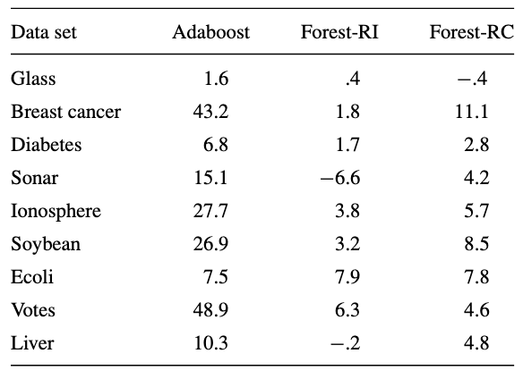

## From CART to Random Forests

Random forests are the result of a sequence of ideas about how to improve the performance of decision trees. The first idea was to use **bagging** (bootstrap aggregating) to reduce the variance of a single decision tree. Bagging involves training multiple decision trees on different bootstrap samples of the training data and then averaging their predictions. After bagging, @breimanRandomForests2001 introduced the idea of **random feature selection** to further reduce the correlation between the trees in the ensemble. This means that at each split in a decision tree, only a random subset of features is considered for splitting, which helps to decorrelate the trees and improve the overall performance of the random forest.

### The starting point: CART

The basic object underlying a random forest is a _decision tree_. The original algorithm is called CART (Classification and Regression Trees) and was introduced by @breimanClassificationRegressionTrees2017. 


Suppose the training sample is $\mathcal D = \{x_i, y_i\}_{i=1}^n$ where $x_i = (x_{i1}, \ldots, x_{iM})\in \R^M$ contains $M$ predictors and $y_i$ is the response. A tree recursively divides the predictor space into terminal regions $R_1, \ldots, R_J$ and the resulting predictors can be represented as a piecewise constant function:
$$
T(x) = \sum_{j=1}^J c_j \mathbf I\{x\in R_j\},
$$
where $\mathbf I\{\cdot\}$ is the indicator function and $c_j$ is the predicted value for region $R_j$.



#### Regression Trees

For regression, $\mathbf{Y}\in \R$. If region $R_j$ contains $N_j$ observations, CART uses the mean response 

$$
\hat c_j = \frac{1}{N_j} \sum_{i: x_i\in R_j} y_i
$$

Thus 

$$
\hat T(x) = \sum_{j=1}^J \hat c_j \mathbf I\{x\in R_j\}
$$

To split a node $R$, consider a predictor $X_m$ and threshold $s$. The candidate split is 

$$
\begin{aligned}
R_L(m, s) &= \{x\in R: x_m \leq s\} \\
R_R(m, s) &= \{x\in R: x_m > s\}. 
\end{aligned}
$$

CART chooses the pair $(m, s)$ giving the largest reduction in squared error, equivalently 

$$
(m^*, s^*) = \arg\min_{m,s}\left[\min_{c_L} \sum_{i: x_i\in R_L(m, s)} (y_i - c_L)^2 + \min_{c_R} \sum_{i: x_i\in R_R(m, s)} (y_i - c_R)^2\right]
$$

The optimal constants are the means in the two child nodes, so we can rewrite the optimization as

$$
(m^*, s^*) = \arg\min_{m,s}\left[\sum_{i: x_i\in R_L(m, s)} (y_i - \frac{1}{N_L} \sum_{j: x_j\in R_L(m, s)} y_j)^2 + \sum_{i: x_i\in R_R(m, s)} (y_i - \frac{1}{N_R} \sum_{j: x_j\in R_R(m, s)} y_j)^2\right]
$$

The main idea is _recursive local optimization_ (aka greedy search). At each node, we search for the split that most effectively separates the responses, and then we repeat the process on the resulting child nodes. The recursion stops when a stopping criterion is met, such as a minimum number of observations in a node or a maximum tree depth.

#### Classification Trees

For classification, $\mathbf{Y}\in \{1, \ldots, K\}$ for $K$ classes. Within node $R$, we can estimate the class probabilities as

$$
\hat p(k\mid R) = \frac{1}{N_R} \sum_{i: x_i\in R} \mathbf I\{y_i = k\}
$$

The node predicts the majority class, i.e., $\hat c_R = \arg\max_k \hat p(k\mid R)$. A common criterion for splitting is the Gini index, which measures the impurity of a node:

$$
G(R) = \sum_{k=1}^K \hat p(k\mid R)(1 - \hat p(k\mid R)) = 1 - \sum_{k=1}^K \hat p(k\mid R)^2
$$

For a proposed split producing $R_L$ and $R_R$, the impurity reduction is

$$
\Delta I = G(R) - \frac{N_L}{N_R^{(\text{parent})}} G(R_L) - \frac{N_R}{N_R^{(\text{parent})}} G(R_R)
$$



The tree then chooses the split that maximizes $\Delta I$. Other impurity measures include cross-entropy (or deviance) and misclassification error.

Thus a single decision tree can be viewed mathematically as a data-dependent partition $\mathcal X = \bigcup_{j=1}^J R_j$ together with a constant prediction $c_j$ for each region. 

### Why one tree is not enough


A decision tree has several advantages: it is easy to interpret, can handle both numerical and categorical data, and can capture non-linear relationships. However, it also has significant drawbacks: its recursive structure can make it __unstable__. A small change in the training sample can change an early split; once an early split changes, all later splits can change as well.

Symbolically, if a learning algorithm $A$ maps a data set into a tree $T=A(\mathcal D)$, then two slightly different data sets $\mathcal D$ and $\mathcal D'$ can produce very different trees $T$ and $T'$. To solve this problem, @breimanBaggingPredictors1996 proposed to use **bagging** (bootstrap aggregating) to reduce the variance of a single decision tree.

### Bagging

For tree $b$, we draw a bootstrap sample $\mathcal D_b^* \sim \text{Bootstrap}(\mathcal D)$ meaning that $N$ observations are sampled with replacement from the original observations.

A tree is then fitted to each bootstrap sample, 

$$
T_b = A(\mathcal D_b^*).
$$ 

For regression, bagging averages them:

$$
\hat f_\text{bag}(x) = \frac{1}{B} \sum_{b=1}^B T_b(x).
$$

For classification, bagging uses majority voting:

$$
\hat y_\text{bag}(x) = \arg\max_k \sum_{b=1}^B \mathbf I\{T_b(x) = k\}
$$

The conceptual change from a single tree to bagging is that we are now averaging over many trees, which reduces the variance of the predictions. The bias of the model remains roughly the same, but the variance is reduced because averaging multiple trees smooths out the fluctuations caused by the instability of individual trees.

However, this raises another question

> What if all the trees are too similar?

If the trees make highly correlated errors, then averaging them cannot remove much of that error. This is where the idea of **random feature selection** comes in, which is the key innovation of random forests.

### Randomizing the trees themselves

During the 1990s, several related ideas appeared for producing more diverse trees. @amitShapeQuantizationRecognition1997 constructed randomized trees for shape recognition and searched over random subsets of a very large family of potential image features. @hoRandomSubspaceMethod1998 trained trees in randomly selected feature subspaces. Instead of giving every tree every predictor, different trees see different subsets of the predictor space. On the other hand, instead of only pertubing the training data, @dietterichExperimentalComparisonThree2000 proposed randomly perturbing the tree construction algorithm itself. For example, instead of always choosing the best split at each node, one could randomly select among the top $k$ splits. This introduces additional randomness into the tree-building process, further decorrelating the trees in the ensemble.

At the same time, @freundDecisiontheoreticGeneralizationOnline1997 showed that many individual limited classifiers could be combined into a powerful ensemble, although boosting obtains diversity through __adaptive reweighting__ rather than independent randomization. 

@breimanRandomForests2001 central idea is that various randomization mechanisms can all be represented by a _random vector controlling tree construction_. This abstraction is what Breiman calls a __random forest__.

## Random Forests 

### The Random-vector formulation

Let $\Theta_1, \Theta_2, \ldots$ be independent random vectors having the same distribution. Tree $k$ is written as $h(\mathbf x, \Theta_k)$, where $\mathbf x$ is the input vector, while $\Theta_k$ represents _whatever random choices were used to construct tree $k$_. For example, $\Theta_k$ might encode the bootstrap sample, the randomly selected predictors at different nodes, randomized split choices, or some combination of these.

::: {#thm-rf}

A random forest is a classifier consisting of a collection of tree-structured classifiers $\{h(\mathbf x, \Theta_k), k=1,\ldots,\}$ where $\{\Theta_k\}\overset{\text{i.i.d.}}{\sim} P_\theta$ and each tree casts a unit vote for the most popular class at input $\mathbf x$.

:::

Note that the random vectors $\Theta_k$ are independent and identically distributed (i.i.d.) according to some distribution $P_\theta$. The randomness in the construction of each tree ensures that the trees are diverse, which is crucial for the success of the random forest algorithm.

### Forest-RI

The particular version most closely corresponding to what is now called a random forest is Breiman's __Forest-RI__, or random-input forests. Let $M$ denote the total number of input variables and $F$ is the number randomly made available at each node.

For each tree $k$, we first generate a bootstrap training set $T_k$ from the original traning sample $T$. Then, at each node, we randomly select 

$$
\mathcal F_{kt} \subseteq \{1, \ldots, M\}, \quad |\mathcal F_{kt}| = F
$$

We then use CART to search for only the $F$ selected inputs: 

$$
(m^*, s^*) = \arg\max_{\substack{m \in \mathcal F_{kt} \\ s}} \Delta I(m,s)
$$

The tree is grown to maximum size is not pruned. So instead of just randomizes the observations as in bagging ($T \to T_k$), RI also randomizes the inputs ($\{1, \ldots, M\} \to \mathcal F_{kt}$). Consequently,

$$
\boxed{\text{Random Forests = Bagging + Random Feature Selection}}
$$

::: {.callout-tip title="Why Random Feature Selection?"}

Suppose predictor $X_1$ is very strong. In ordinary bagging, $X_1$ may appear nea the top of every tree, so all the trees will be very similar even though they are trained on different bootstrap samples.

Rnadom feature selection sometimes removes $X_1$ from consideration ($X_1\not \in \mathcal F_{kt}$). The tree must then discover an alternative route. Individual trees may become weaker, but the collection becomes less correlated.

:::

## Characterizing the accuracy of random forests

We (may) wonder why should a large collection of randomized trees work? In @breimanRandomForests2001, Breiman provides a theoretical analysis of the accuracy of random forests. First, as more trees are added, the forest converges. Second, predictive quality is governed by a trade-off between __tree strength__ and __tree correlation__. 

### Margin and generalization error

Consider classifiers $h_1(\mathbf x), \ldots, h_K(\mathbf x)$, and for an observation $(\mathbf X, Y)$, we define the _margin function_ as

$$
\mg(\mathbf X, Y) = \underbrace{\av_k \mathbf{I}\{h_k(\mathbf X) = Y\}}_{\substack{\text{proportion of trees}\\ \text{voting for the correct class}}} - \underbrace{\max_{j\neq Y} \av_k \mathbf{I}\{h_k(\mathbf X) = j\}}_{\substack{\text{largest proportion voting} \\ \text{for any incorrect class}}}.
$$

Thus $\mg(\mathbf X, Y)>0$ means that the correct class receives more votes than every competing class, while $\mg(\mathbf X, Y)<0$ means that some wrong clas defeats the correct class. The __generalization error__ is then defined as the probability of a negative margin:

$$
\PE^* = \mathbb P_{\mathbf X, Y}(\mg(\mathbf X, Y) < 0)
$$

> **Convergence of the forest**

For a random forest, $h_k(\mathbf x) = h(\mathbf x, \Theta_k)$. Since the $\Theta_k$ are iid, the Strong Law of Large Numbers implies, for a fixed class $j$,

$$
\frac{1}{K} \sum_{k=1}^K \mathbf I\{h_k(\mathbf X) = j\} \to \mathbb P_\Theta(h(\mathbf X, \Theta) = j) \quad \text{as } K\to\infty
$$


::: {#thm-convergence-rf}

As the number of trees increases, for almost surely all sequence $\Theta_1,\ldots$, $\PE^*$ converges to 

$$
\mathbb P_{\mathbf X, Y}(P_\theta(h(\mathbf X, \Theta) = Y) - \max_{j\neq Y} P_\Theta(h(\mathbf X, \Theta) = j) < 0)
$$

:::

The theorem says that _holding the data-generating procedure for the trees fixed_, repeatedly adding iid randomized trees causes the ensemble vote to stabilize. The error approaches a limiting value rather than becoming increasingly random because more trees are added. 

### Population Margin and Strength

::: {#def-margin-strength}

The margin function for a random forest is 

$$
\mr(\mathbf X, Y) = P_\Theta(h(\mathbf X, \Theta) = Y) - \max_{j\neq Y} P_\Theta(h(\mathbf X, \Theta) = j)
$$

and the strength of the set of classifiers $\{h(\mathbf x, \Theta)\}$ is 

$$
s = \E_{\mathbf X, Y}[\mr(\mathbf X, Y)].
$$

:::

Strength measures the expected margin by which the randomized tree-generating mechanism favors the correct class. Large positive $s$ means that, on average, the forest's tree distribution strongly favors the correct class. 

Because $\PE^*=\mathbb P(\mr(\mathbf X, Y) < 0)$ and $\E[\mr(\mathbf X, Y)] = s$, we can use Chebyshev's inequality to bound the generalization error in terms of the strength and variance of the margin function:

$$
\PE^* \leq \frac{\var(\mr(\mathbf X, Y))}{s^2}
$$

::: {.derivation-note}
[Where does this inequality come from?]{.derivation-note-trigger tabindex="0"}

::: {.derivation-note-body}
We want to bound $\mathbb P(\mr(\mathbf X, Y) < 0)$ in terms of the mean and variance of $\mr(\mathbf X, Y)$. We know that $\E[\mr(\mathbf X, Y)] = s$ and $\var(\mr(\mathbf X, Y)) = \sigma^2$.

Draw the idea on a number line:

$$
\underbrace{\text{error region}}_{\text{mr<0}}   \qquad  0 \qquad  s=\underbrace{\E[\mr(\mathbf X, Y)]}_{\text{mean}} 
$$

If $\mr<0$, then $\mr$ must be at least distance $s$ below its mean $s. Indead, if $\mr<0$, then $\mr - s < -s$. Thus $| \mr - s | > s$. So the event $\{\mr < 0\}$ is contained in the event $\{|\mr - s| > s\}$. Symbolically, we have

$$
\{\mr < 0\} \subseteq \{|\mr - s| > s\} \implies \mathbb P(\mr < 0) \leq \mathbb P(|\mr - s| > s)
$$

Now we can apply Chebyshev's inequality, which states that for any random variable $X$ with mean $\mu$ and variance $\sigma^2$,

$$
\mathbb P(|X - \mu| > k) \leq \frac{\sigma^2}{k^2}.
$$

Then 

$$
\mathbb P(|\mr - s| > s) \leq \frac{\var(\mr)}{s^2}
$$

Combining the two inequalities gives us the desired result:

$$
\PE^* = \mathbb P(\mr < 0) \leq \mathbb P(|\mr - s| > s) \leq \frac{\var(\mr)}{s^2}
$$

:::
:::

We then let the most competitive wrong class is

$$
\hat j(\mathbf X, Y) = \arg\max_{j\neq Y} P_\Theta(h(\mathbf X, \Theta) = j)
$$

Then 

$$
\begin{aligned}
\mr(\mathbf X, Y) &= P_\Theta(h(\mathbf X, \Theta) = Y) - P_\Theta(h(\mathbf X, \Theta) = \hat j(\mathbf X, Y)) \\
&= \E_\Theta[\mathbf I\{h(\mathbf X, \Theta) = Y\} - \mathbf I\{h(\mathbf X, \Theta) = \hat j(\mathbf X, Y)\}] 
\end{aligned}
$$

::: {#def-raw-margin}

The _raw margin function_ is 

$$
\rmg(\Theta, \mathbf X, Y) = \mathbf I\{h(\mathbf X, \Theta) = Y\} - \mathbf I\{h(\mathbf X, \Theta) = \hat j(\mathbf X, Y)\}
$$

Consequently, the margin function is the expected raw margin:

$$
\mr(\mathbf X, Y) = \E_\Theta[\rmg(\Theta, \mathbf X, Y)]
$$

:::

As we can see, $\rmg$ belongs to an individual randomized tree, while $\mr$ belongs to the infinite forest. Take two independent tree-generating vectors

$$
\Theta, \Theta' \overset{\text{i.i.d.}}{\sim} P_\Theta
$$

The variance of the forest margin can then be related to the covariance of their raw margins. Let $\rho(\Theta, \Theta')$ denote the correlation, over $(\mathbf X, Y)$ between $\rmg(\Theta, \mathbf X, Y)$ and $\rmg(\Theta', \mathbf X, Y)$, and let 

$$
\sd(\Theta) = \sqrt{\var_{\mathbf X, Y}[\rmg(\Theta, \mathbf X, Y)]}
$$

We then define an average weighted correlation $\overline{\rho}$ so that 

$$
\var(mr) = \overline{\rho} (\E_\Theta\sd(\Theta))^2.
$$

The derivation and weighting are given in the paper's equation (5)-(8). Since 

$$
\E_Theta\var(\Theta) \leq \E_\Theta(\E_{\mathbf X, Y}[\rmg(\Theta, \mathbf X, Y)])^2 - s^2 \leq 1-s^2
$$

we obtain Breiman's bound on the generalization error.

::: {#thm-strength-correlation-bound}

## The Strength-Correlation Bound

An upper bound for the generalization error is given by 

$$
\PE^* \leq \overline{\rho} \frac{1-s^2}{s^2}
$$

:::

A good forests wants $s$ large and $\overline{\rho}$ small. Allowing every tree to examine every predictor can make individual trees strong, but it can also make them highly correlated. Strongly randomizing the trees can make them almost independent, but it can also make them weak. Random forest design is therefore a balancing problem between tree strength and tree correlation.

::: {#def-trade-off-ratio}

The c/s2 raito for a random forest is defined as

$$
\frac{c}{s^2} = \frac{\overline{\rho}}{s^2}
$$

:::

For two classes the interpretation simplifies to

$$
\mr(\mathbf X, Y) = 2 P_\Theta(h(\mathbf X, \Theta) = Y) - 1
$$

Hence positive strength corresponds to a randomized tree being correct more often than random guessing:

$$
\E_{\mathbf X, Y}[\mr(\mathbf X, Y)] > 0 \iff \E_{\mathbf X, Y}[P_\Theta(h(\mathbf X, \Theta) = Y)] > \frac{1}{2}
$$

Therefore, individual trees must be better than random guessing, but they do not need to be very strong. The correlation $\overline{\rho}$ is the average correlation between the raw margins of two independent trees. If the trees are highly correlated, then their errors will also be correlated, and averaging them will not reduce the overall error much. Conversely, if the trees are weakly correlated, then averaging them will lead to a more significant reduction in error.

## Constructing and monitoring the forest

### Out-of-bag observations 

Recall that each bootstrap training set $T_k$ contains $N$ draws with replacement from the original $N$ observations. For a particular observation $i$, the probability that it is not selected on one draw is 

$$
1-\frac{1}{N}.
$$

The probability that it is omitted from all $N$ bootstrap draws is 

$$
\left(1-\frac{1}{N}\right)^N \to e^{-1} \approx 0.368
$$

Thus roughly 36.8% - approximately one third of the observations are absent from any particular bootstrap sample. These observations are the tree's __out-of-bag observations__. For training observation $(x_i, y_i)$, we define 

$$
\mathcal K_i = \{k:(x_i, y_i)\not \in T_k\}.
$$

Only trees in $K_i$ are allowed to predict $x_i$. The OOB classifer is therefore 

$$
\hat y_i^\text{OOB} = \arg\max_j \sum_{k\in \mathcal K_i} \mathbf I\{h(x_i, \Theta_k) = j\}
$$


The OOB error estimate is 

$$
\hat{\PE}_{\text{OOB}} = \frac{1}{N} \sum_{i=1}^N \mathbf I\{\hat y_i^\text{OOB} \neq y_i\} 
$$

This is the consequence of bagging: the observations omitted while constructing each tree can be used to estimate the error of that tree.

### Forest-RI

In Forest-RI, there are $M$ original predictors. At every node, sample $F$ of them and search only those variables for the best CART split. Symbolically, 

$$
\mathcal F \sim \text{random subset of } \{1,\ldots, M\}, \qquad |\mathcal F| = F
$$

followed by 

$$
(m^*, s^*) = \arg\max_{m\in \mathcal F, s} \Delta I(m, s)
$$

If $F$ is large, each node has a good chance of seeing the strongest variables, but different trees will repeatedly discover similar splits. If $F$ is small, the opposite occurs.

### Forest-RC

@breimanRandomForests2001 also proposed a second construction, __Forest-RC__. Instead of choosing only original variables, generate random linear combinations. At a node, select $L$ inputs and coefficients

$$
\alpha_1, \ldots, \alpha_L \overset{\text{i.i.d.}}{\sim} \text{Uniform}(-1, 1)
$$

A candidate feature has the form 

$$
Z = \sum_{\ell=1}^L \alpha_\ell X_{j_\ell}
$$

We then search over $F$ such random features for the best split. This is a more general form of randomization, as it allows for combinations of features rather than just individual features. It can be particularly useful when the relationship between the predictors and the response is complex and not easily captured by single features.

## Behavior of Random Forests

### Why using fewer variables can improve the forest

{#fig-sonar-data}

For the sonar data in @fig-sonar-data, Breiman varies $F$, the number of candidate variables available at a node. Initially, increasing $F$ improves tree strength, but after around $F=4$, strength becomes nearly constant while tree correlation continues to increase. Corresponding, test and out-of-bag error begin increasing. So when $F$ increases, $s$ increases, but when $s$ is nearly constant, increasing $F$ only increases $\overline{\rho}$, which increases the generalization error. 

### Relation to boosting


Unlike a random forest, AdaBoost is sequential. The weight distribution used to train the next classifier depends on the errors made previously. If $w^{(k)}$ denotes the training weights at iteration $k$, we can write the dynamics as

$$
w^{(k+1)} = \phi(w^{(k)})
$$

where $\phi$ is a deterministic function of the previous weights. We then defines an operator 

$$
Tf(w) = f(\phi(w))
$$

and conjectures that this transformation have an invariant distribution. Under that conjecture, the long-run boosting sequence could behave like sampling classifiers from a distribution over weights, making its limiting behavior resemble a form of random forest. 

However, this is just a conjecture. More condition are needed to make this rigorous.

### Robustness to label noise



@breimanRandomForests2001 compares Random Forests-RI, Forest-RC, and AdaBoost under artificial label noise. He changes approximately 5% of the training labels and observes that AdaBoost can degrade significantly more than the random forest procedures. 

Boosting repeatedly increases the influence of misclassified observations. If an observation is mislabled, it may remain persistently difficult to classify, causing the algorithm to devote increasing attention to noise. Random forests do not have this problem because each tree is built independently, and the averaging process helps to mitigate the impact of mislabeled data.

### Many weak predictors and many weak trees

@breimanRandomForests2001 also introduces a problem with $M=1000$ binary predictors, each carrying little information. Individual trees perform poorly, however, Breiman shows that Forest-RI can achieve good ensemble performance when the tree correlations remain low. So if $\overline \rho$ is small, the ensemble can still perform well even if individual trees are weak. 

### Variable importance from OOB perturbation

Suppose $X_m$ is predictor $m$. For each tree, take its OOB observations and randomly permute the values of $X_m$:

$$
(x_{1m}, \ldots, x_{nm}) \to (x_{\pi(1)m}, \ldots, x_{\pi(n)m})
$$

where $\pi$ is a random permutation of $\{1, \ldots, n\}$ and leaving the other variables unchanged. We then compute the OOB error again. A simple permutation-importance measure can be written as

$$
VI_m = \Err_{\text{OOB}}^{\text{perm(m)}}- \Err_{\text{OOB}}
$$

If destroying the association between $X_m$ and the response causes a large increase in prediction error, $X_m$ is considered important.

We also talk about the _correlated predictors_. Suppose $X_1$ and $X_2$ are highly correlated, and both encode the same predictive information. Permuting $X_1$ can hurt because the forest uses it; permuting $X_2$ can also hurt because the forest uses it. Yet once $X_1$ is available, adding $X_2$ may provide almost no additional information. In this case, the importance of $X_2$ may appear low even though it is predictive. This is a limitation of permutation-based variable importance measures in the presence of correlated predictors.

### Regression forests

Now suppose $h(\mathbf x, \Theta) \in \R$ is a regression tree. For one numerical predictor $h(x)$, we define the mean-squared generalization error as 

$$
\E_{\mathbf X, Y}[(Y - h(\mathbf X))^2]
$$

A $K$-tree regression forest predicts

$$
\hat f_K(\mathbf x) = \av_k h(\mathbf x, \Theta_k) = \frac{1}{K} \sum_{k=1}^K h(\mathbf x, \Theta_k)
$$

::: {#thm-convergence-rf-regression}

As the number of trees in the forest goes to infinity, almost surely,

$$
\E_{\mathbf X, Y}[(Y - \av_k h(\mathbf X, \Theta_k))^2] \to \E_{\mathbf X, Y}[(Y - \E_\Theta[h(\mathbf X, \Theta)])^2]
$$

:::

Thus averaging increasingly many randomized regression trees again converges to a stable limiting predictor $f_{RF}(x) = \E_\Theta[h(x, \Theta)]$. 

We can also define 

$$
\PE^*(\text{forest}) = \E_{\mathbf X, Y}[(Y - \E_{\Theta}[h(\mathbf X, \Theta)])^2]
$$

and average individual-tree errors

$$
\PE^*(\text{tree}) = \E_\Theta \E_{\mathbf X, Y}[(Y - h(\mathbf X, \Theta_k))^2]
$$

::: {#thm-strength-correlation-bound-regression}

Assume that for all $\Theta$, $\E Y = \E_Xh(\mathbf X, \Theta)$. Then 

$$
\PE^*(\text{forest}) \leq \overline{\rho} \PE^*(\text{tree})
$$

where $\overline{\rho}$ is the weighted correlation between the residuals $Y-h(\mathbf X, \Theta)$ and $Y-h(\mathbf X, \Theta')$ where $\Theta, \Theta'$ are independent.
:::

So the classification and regression cases are similar. The generalization error of the forest is bounded by the correlation between the individual trees and their strength. If the trees are weakly correlated, then the ensemble can achieve good performance even if individual trees are weak.

## Random Forests in Practice

The purpose of this section is to turn the mathematical description above into an algorithm. Rather than calling `sklearn.ensemble.RandomForestClassifier`, we will construct the essential pieces so that every line of code corresponds to an idea developed above.

Following @breimanRandomForests2001, let $T= \{(x_i, y_i)\}_{i=1}^N, x_i\in \R^M$, where $N$ is the number of observations and $M$ the number of input variables. A random forest consists of tree classifiers $h(\mathbf x, \Theta_k)$, where the random vectors $\Theta_k$ are independently generated. In Forest-RI construction, each tree receives a bootstrap sample of the training data, and at each node only $F$ randomly chosen variables are considered for splitting. The trees are then grown using CART.


### Constructing the data

For visualization, it is useful to work with only two predictors $X = (X_1, X_2)$. We generate points uniformly inside a square and define the underlying class relationship by 

$$
Y = \mathbf I\{X_1^2 + X_2^2 > 2\}
$$

Thus observations near the center belong to class 0, while observations farther from the center belong to class 1. A small amount of label noise is added. 

```{python}
import numpy as np
import matplotlib.pyplot as plt

rng = np.random.default_rng(6400)

N = 500

X = rng.uniform(-2, 2, size=(N, 2))

y = (X[:, 0]**2 + X[:, 1]**2 > 2).astype(int)

# add a small amount of label noise
noise = rng.random(N) < 0.08
y[noise] = 1 - y[noise]
```

```{python}
plt.figure(figsize=(6,5))
plt.scatter(X[:, 0], X[:, 1], c=y, s=25, alpha=0.8)
plt.xlabel("$X_1$")
plt.ylabel("$X_2$")
plt.title("Synthetic classification data")
plt.show()
```

### Building a single tree

A random forest is still built from decision trees. We therefore begin with CART. Suppose a node contains observations indexed by a region $R$. For binary classification, let 

$$
\hat p_k(R) = \frac{1}{N_R} \sum_{i: x_i\in R} \mathbf I\{y_i = k\}
$$

The Gini impurity is 

$$
G(R) = 1 - \sum{k} \hat p_k(R)^2
$$

A completely pure node has $G(R) = 0$. For a candidate split based on variable $m$ and threshold $s$, the left and right child nodes are

$$
R_L(m, s) = \{x\in R: x_m \leq s\}, \quad R_R(m, s) = \{x\in R: x_m > s\}
$$

The weighted impurity after the split is 

$$
G_\text{split} = \frac{N_L}{N_R} G(R_L(m, s)) + \frac{N_R'}{N_R} G(R_R(m, s))
$$

where here $N_R'$ denotes the number of observations in the right child. Equivalently, we maximize the impurity reduction 

$$
\Delta I = G(R) - G_\text{split}
$$

Since $G(R)$ is constant while examining candidate splits wihtin one node, minimizing $G_\text{split}$ is equivalent to maximizing $\Delta I$.

```{.pseudo}
GINI(y)
    count the observations in each class
    convert the counts into class probabilities
    return
        1 - sum(probabilities^2)

```

```{python}
def gini(y):
    """Compute the Gini impurity of a set of labels y."""
    classes, counts = np.unique(y, return_counts=True)
    probabilities = counts / len(y)
    return 1 - np.sum(probabilities ** 2)
```

For example, consider a perfect mixed node,

$$
P(Y = 0) = P(Y = 1) = 0.5 \implies G(R) = 1 - (0.5^2 + 0.5^2) = 0.5
$$

A pure node has probabilites $(1, 0)$ or $(0, 1)$, giving $G(R) = 0$.

Suppose the node currently contains the data $(\mathbf X, Y)$. For each possible variable $m$, we consider candidate thresholds $s$. For every candidate split we compute 

$$
\frac{N_L}{N} G(y_L) + \frac{N_R}{N} G(y_R).
$$

The best split minimizes this quantity.

```{.pseudo}
BEST_SPLIT(X, y, candidates_features)
    best_score = infty
    for each feature m in candidates_features:
        construct candidate thresholds
        for each threshold s:
            send observations with X_m <= s to the left
            send observations with X_m > s to the right
            
            if either child is empty:
                continue
            
            calculate Gini(left), Gini(right)
            calculate weighted impurity

            if weighted impurity < best_score:
                save:
                    feature m, threshold s, left observations, right observations
    return best split
```

```{python}
def best_split(X, y, candidate_features):
    """Find the best split for a node given candidate features."""
     
    n = len(y)
    best_score = np.inf
    best_feature = None
    best_threshold = None
    best_left = None
    best_right = None

    for feature in candidate_features:
        values = np.unique(X[:, feature])

        if len(values) <= 1:
            continue  # No split possible
        
        # thresholds halfway between adjacent observed values
        thresholds = (values[:-1] + values[1:]) / 2

        for threshold in thresholds:
            left = X[:, feature] <= threshold
            right = ~left

            if left.sum() == 0 or right.sum() == 0:
                continue  # Skip empty splits
            
            score = (left.sum() / n) * gini(y[left]) + (right.sum() / n) * gini(y[right])

            if score < best_score:
                best_score = score
                best_feature = feature
                best_threshold = threshold
                best_left = left
                best_right = right

    return best_feature, best_threshold, best_left, best_right
```

Once the possible predictors have been specified, CART searches them and selects the best split according to its criterion.

### Growing the tree recursively

A tree repeats the previous operation. At the root, $R_0 = \R^M$ contains all the training data. After one split,

$$
R_0 \to R_L, R_R
$$

Each child is then split again:

$$
\begin{aligned}
R_L &\to R_{LL}, R_{LR} \\
R_R &\to R_{RL}, R_{RR}
\end{aligned}
$$

and the procedure continues recursively. We first need an object that stores a node.

```{python}
class Node:
    def __init__(self, feature=None, threshold=None, left=None, right=None, prediction=None):
        self.feature = feature
        self.threshold = threshold
        self.left = left
        self.right = right
        self.prediction = prediction

```

A terminal node needs only a prediction. For a classification, this is the majority class $\hat c_R = \arg\max_k \hat p(k\mid R)$. 

```{python}
def majority_class(y):
    """Return the majority class label from y."""
    classes, counts = np.unique(y, return_counts=True)
    return classes[np.argmax(counts)]
```

For an ordinary CART tree, every node considers $\{1, \ldots, M\}$. Forest-RI instead randomly samples $\mathcal F\subseteq \{1, \ldots, M\}$ of size $F$ at each node. CART then finds the best split within $\mathcal F$. Thus the recursive algorithm becomes:

```{.pseudo}
GROW_TREE(X, y, F)
    if node is pure
        return leaf
    if another stopping rule is reached
        return leaf
    randomly choose F predictors
    among those F predictors:
        find the best CART split

    if no split exists:
        return leaf
    
    recursively grow left and right children
    return node
```

```{python}
def grow_tree(X, y, F, rng, depth=0, max_depth=None, min_samples_leaf=1):
    """Recursively grow a decision tree."""
    if min_samples_leaf is None:
        min_samples_leaf = 1

    # stop if the node is pure
    if len(np.unique(y)) == 1:
        return Node(prediction=y[0])
    # depth restriction
    if max_depth is not None and depth >= max_depth:
        return Node(prediction=majority_class(y))
    # cannot split further
    if len(y) < 2*min_samples_leaf:
        return Node(prediction=majority_class(y))
    
    M = X.shape[1]
    F = min(F, M) # Ensure F does not exceed number of features

    # random forest feature selection
    candidate_features = rng.choice(M, size=F, replace=False)

    # CART
    feature, threshold, left, right = best_split(X, y, candidate_features)

    if feature is None:
        return Node(prediction=majority_class(y))
    
    if left.sum() < min_samples_leaf or right.sum() < min_samples_leaf:
        return Node(prediction=majority_class(y))
    
    left_child = grow_tree(X[left], y[left], F, rng, depth + 1, max_depth, min_samples_leaf)

    right_child = grow_tree(X[right], y[right], F, rng, depth + 1, max_depth, min_samples_leaf)

    return Node(feature=feature, threshold=threshold, left=left_child, right=right_child)
```

Once a tree has been constructed, prediction itself contains no randomization. At a node with split $x_m\leq s$, we move left if the condition holds and right otherwise.

```{.pseudo}
PREDICT_TREE(x, node)
    if node is a leaf:
        return its class
    if x[node.feature] <= node.threshold:
        move to left child
    else:
        move to right child
```

```{python}
def predict_tree_one(x, node):
    """Predict the class label for a single observation x using the tree rooted at node."""
    if node.prediction is not None:
        return node.prediction
    if x[node.feature] <= node.threshold:
        return predict_tree_one(x, node.left)
    return predict_tree_one(x, node.right)
```

For multiple observations:

```{python}
def predict_tree(X, node):
    """Predict class labels for multiple observations X using the tree rooted at node."""
    return np.array([predict_tree_one(x, node) for x in X])
```

### From one tree to a random forest

We now introduce the second source of randomness: boostrap sampling. For tree $k$, we generate $T_k$ by sampling $N$ observations with replacement from $T$. 

```{.pseudo}
BOOTSTRAP(T)
    sample N indicies from {1, ..., N} with replacement

    observations selected at least once:
        bootstrap trianing set
    observations never selected:
        out-of-bag observations
    return both sets
```

```{python}
def bootstrap_indices(N, rng):
    """Generate bootstrap indices and out-of-bag indices."""
    bootstrap = rng.integers(0, N, size=N)
    used = np.zeros(N, dtype=bool)
    used[np.unique(bootstrap)] = True
    oob = np.where(~used)[0]
    return bootstrap, oob
```

Because sampling is with replacement, some observations occur multiple times, while others do not occur at all. For observation $i$,

$$
\P(i \text{ is OOB}) = \left(1 - \frac{1}{N}\right)^N \to e^{-1} \approx 0.368
$$

Thus around 36.8% of the observations are available as internal test observations for each tree.

Tree $k$ now has two random components:

$$
\Theta_k = \{\text{bootstrap sample, feature subsets at nodes}\}
$$

```{.pseudo}
RANDOMIZED_TREE(T, F)
    bootstrap a training sample T_k
    begin at root
    at every node:
        randomly select F out of M predictors
        among these F predictors, use CART to find the best split
    continue recursively
    return tree h(x, Theta_k)
```

```{python}
boostrap, oob = bootstrap_indices(len(y), rng)

tree = grow_tree(X[boostrap], y[boostrap], F=1, rng=rng)
```

@breimanRandomForests2001 random forest consists of iid randomized trees

$$
h(\mathbf x, \Theta_1), \ldots, h(\mathbf x, \Theta_K)
$$

```{.pseudo}
RANDOM_FOREST(T, K, F)
    forest = empty collection 
    repeat k = 1, ..., K:
        create boostrap sample T_k
        construct randomized tree
            h(x, Theta_k)
        save tree
    return forest
```

```{python}
class RandomForestScratch:
    def __init__(self, n_trees=100, F=1, max_depth=None, min_samples_leaf=1, random_state=6400):
        self.n_trees = n_trees
        self.F = F
        self.max_depth = max_depth
        self.min_samples_leaf = min_samples_leaf
        self.rng = np.random.default_rng(random_state)
        self.trees = []
        self.oob_indices = []
    
    def fit(self, X, y):
        self.trees = []
        self.oob_indices = []
        N = len(y)
        for _ in range(self.n_trees):
            bootstrap, oob = bootstrap_indices(N, self.rng)
            tree = grow_tree(X[bootstrap], y[bootstrap], F=self.F, rng=self.rng, max_depth=self.max_depth, min_samples_leaf=self.min_samples_leaf)
            self.trees.append(tree)
            self.oob_indices.append(oob)
        return self
```

### Forest prediction and OOB evaluation

For classification, each tree casts one vote. For observation $x$, define 

$$
V_j(x) = \sum_{k=1}^K \mathbf I\{h(x, \Theta_k) = j\}
$$

The random-forest prediction is 

$$
\hat y(x) = \arg\max_j V_j(x)
$$

```{.pseudo}
PREDICT_FOREST(x)
    obtain prediction from every tree
    count votes for every class
    return class receiving the most votes
```

```{python}
class RandomForestScratch:
    def __init__(self, n_trees=100, F=1, max_depth=None, min_samples_leaf=1, random_state=6400):
        self.n_trees = n_trees
        self.F = F
        self.max_depth = max_depth
        self.min_samples_leaf = min_samples_leaf
        self.rng = np.random.default_rng(random_state)
        self.trees = []
        self.oob_indices = []
    
    def fit(self, X, y):
        self.trees = []
        self.oob_indices = []
        N = len(y)
        for _ in range(self.n_trees):
            bootstrap, oob = bootstrap_indices(N, self.rng)
            tree = grow_tree(X[bootstrap], y[bootstrap], F=self.F, rng=self.rng, max_depth=self.max_depth, min_samples_leaf=self.min_samples_leaf)
            self.trees.append(tree)
            self.oob_indices.append(oob)
        return self
    
    def predict(self, X):
        all_predictions = np.array([predict_tree(X, tree) for tree in self.trees])
        predictions = []

        for i in range(X.shape[0]):
            values, counts = np.unique(all_predictions[:, i], return_counts=True)
            predictions.append(values[np.argmax(counts)])
        return np.array(predictions)
```

We can now train the model.

```{python}
forest = RandomForestScratch(n_trees=200, F=1, max_depth=None, min_samples_leaf=1, random_state=6400)

forest.fit(X, y)
```

Here $M=2, F=1$, so each split allowed to examine only one randomly selected predictor. This is a very strong randomization, but it is sufficient to produce a good forest.

The boostrap mechanism gives us an additional benefit. For observation $i$, define 

$$
\mathcal K_i = \{k: i \not \in T_k\}.
$$

Its OOB prediction uses only trees that did not train on observation $i$:

$$
\hat y_i^\text{OOB} = \arg\max_j \sum_{k\in \mathcal K_i} \mathbf I\{h(x_i, \Theta_k) = j\}
$$

```{python}
def oob_predict(forest, X):
    """Compute OOB predictions for each observation."""
    N =len(X)
    predictions = np.full(N, np.nan)

    for i in range(N):
        votes = []
        for tree, oob in zip(forest.trees, forest.oob_indices):
            if i in oob:
                votes.append(predict_tree_one(X[i], tree))
        if len(votes) > 0:
            values, counts = np.unique(votes, return_counts = True)
            predictions[i] = values[np.argmax(counts)]
    return predictions
```

```{python}
oob_pred = oob_predict(forest, X)
valid = ~np.isnan(oob_pred)

oob_accuracy = np.mean(oob_pred[valid] == y[valid])
print(f"OOB accuracy: {oob_accuracy:.4f}")
```

### Visualizing the prediction relationship

We want to see the learned function $x\mapsto \hat y(x)$. Because our predictors are two-dimensional, we can visualize the decision boundary. We create a grid of points over the feature space and predict the class for each point.

```{python}
def make_grid(X, points = 250):
    """Create a grid of points over the feature space."""
    x1 = np.linspace(X[:, 0].min() - 0.2, X[:, 0].max() + 0.2, points)
    x2 = np.linspace(X[:, 1].min() - 0.2, X[:, 1].max() + 0.2, points)
    xx1, xx2 = np.meshgrid(x1, x2)
    grid = np.column_stack([xx1.ravel(), xx2.ravel()])
    return xx1, xx2, grid
```

For every grid point $x$, we evaluate $\hat y(x)$ and visualize the decision boundary.

> **One CART tree**

First fit one CART tree using both features.

```{python}
single_tree = np.random.default_rng(6400)

single_tree = grow_tree(X, y, F=2, rng=single_tree, max_depth=None, min_samples_leaf=None)
```

Here we use $F=M=2$, so this is a standard CART tree. 

```{python}
xx1, xx2, grid = make_grid(X)

tree_prediction = predict_tree(grid, single_tree).reshape(xx1.shape)

plt.figure(figsize=(7,5))
plt.contourf(xx1, xx2, tree_prediction, alpha=0.25)
plt.scatter(X[:, 0], X[:, 1], c=y, s=25)
plt.xlabel("$X_1$")
plt.ylabel("$X_2$")
plt.title("Decision boundary of a single CART tree")
plt.show()
```

> *One randomized tree*

Now we look at just one tree from the forest.

```{python}
random_tree = forest.trees[0]

random_prediction = predict_tree(grid, random_tree).reshape(xx1.shape)

plt.figure(figsize=(7,5))

plt.contourf(xx1, xx2, random_prediction, alpha=0.25)
plt.scatter(X[:, 0], X[:, 1], c=y, s=25)

plt.xlabel("$X_1$")
plt.ylabel("$X_2$")
plt.title("Decision boundary of a single randomized tree")
plt.show()
```

> *The complete random forest*

Now predict each grid point using all $K$ trees.

```{python}
forest_prediction = forest.predict(grid).reshape(xx1.shape)
plt.figure(figsize=(7,5))
plt.contourf(xx1, xx2, forest_prediction, alpha=0.25)
plt.scatter(X[:, 0], X[:, 1], c=y, s=25)
plt.xlabel("$X_1$")
plt.ylabel("$X_2$")
plt.title("Decision boundary of the random forest")
plt.show()
```

> **Class-vote probabilty**

We can calculate the proportion of trees voting for class 1 at each grid point. This gives us a probability estimate.

$$
\hat p_{RF}(1\mid x) = \frac{1}{K} \sum_{k=1}^K \mathbf I\{h(x, \Theta_k) = 1\}
$$

```{python}
def predict_vote_probability(forest, X):
    """Compute the proportion of trees voting for class 1."""
    votes = np.array([predict_tree(X, tree) for tree in forest.trees])
    return np.mean(votes == 1, axis=0)
```

Compute it over the grid:

```{python}
probability = predict_vote_probability(forest, grid).reshape(xx1.shape)
```

Plot:

```{python}
plt.figure(figsize=(7,5))
contour = plt.contourf(xx1, xx2, probability, levels=np.linspace(0, 1, 21))
plt.contour(xx1, xx2, probability, levels=[0.5])
plt.scatter(X[:, 0], X[:, 1], c=y, s=20)
plt.colorbar(contour, label="Fraction of trees voting for class 1")
plt.xlabel("$X_1$")
plt.ylabel("$X_2$")
plt.title("Random forest vote surface")
plt.show()
```

> *Visualizing the role of the number of trees*

```{python}
tree_counts = [1, 5, 10, 20, 50, 100, 200]

oob_errors = []

for K in tree_counts:
    model = RandomForestScratch(n_trees=K, F=1, min_samples_leaf=2, random_state=6400)

    model.fit(X, y)
    pred = oob_predict(model, X)
    valid = ~np.isnan(pred)
    error = np.mean(pred[valid] != y[valid])
    oob_errors.append(error)
```

Plot:

```{python}
plt.figure(figsize=(7,5))
plt.plot(tree_counts, oob_errors, 'o-')
plt.xlabel("Number of trees")
plt.ylabel("OOB error")
plt.title("Random forest performance vs. number of trees")
plt.show()
```

The expected qualitative behavior is $\PE_K\to \PE^*$. We can estimate the boudn directly in this case.

```{python}
def estimate_rf_bound(forest, X, y):
    """Estimate the strength-correlation bound for the random forest."""
    K = len(forest.trees)
    N = len(y)
    
    # store each tree's oob predictions
    oob_predictions = np.full((K, N), np.nan)
    for k, (tree, oob) in enumerate(zip(forest.trees, forest.oob_indices)):
        oob_predictions[k, oob] = predict_tree(X[oob], tree)
    # oob vote probability of correct class
    correct = np.full((K, N), np.nan)
    for k in range(K):
        mask = ~np.isnan(oob_predictions[k])
        correct[k, mask] = (oob_predictions[k, mask] == y[mask])
    n_oob = np.sum(~np.isnan(correct), axis=0)
    p_correct = np.nansum(correct, axis=0) / n_oob

    # binary class margin 
    margins = 2 * p_correct - 1

    # strength
    s = np.mean(margins)

    # variance of margins
    var_margin = np.mean(margins ** 2) - s ** 2

    # estimate E[sd(Theta)]
    tree_sd = []
    for k in range(K):
        mask = ~np.isnan(oob_predictions[k])
        tree_correct = oob_predictions[k, mask] == y[mask]
        p1 = np.mean(tree_correct)
        # binary classification 
        p2 = 1- p1
        sd_k = np.sqrt(p1+p2 - (p1 - p2) ** 2)
        tree_sd.append(sd_k)
    mean_sd = np.mean(tree_sd)

    # average correlation
    rho_bar = var_margin/mean_sd ** 2

    # Breiman's bound
    chebyshev_bound = var_margin / mean_sd ** 2
    theorem_bound = rho_bar * (1 - s ** 2) / s ** 2

    return {
        "strength": s, 
        "margin_variance": var_margin,
        "mean_tree_sd": mean_sd,
        "rho_bar": rho_bar,
        "chebyshev_bound": chebyshev_bound,
        "theorem_bound": theorem_bound
    }
```

```{python}
results = estimate_rf_bound(forest, X, y)
for name, value in results.items():
    print(f"{name}: {value:.4f}")
```

## Considerations for using Random Forests

### Data assumptions

For many problems, we sometimes assume that the training set is independently drawn from the distribution of the random vector $(\mathbf X, Y)$. Therefore, although random forests impose few assumptions about the shape of relationship $Y = f(\mathbf X) + \epsilon$, they still depend on the predictive assumption that 

$$
P_\text{train}(\mathbf X, Y) \approx P_\text{future}(\mathbf X, Y)
$$

If the future population differs significantly from the training data, the model may not generalize well. 

### Randomization must preserve tree strength

Recall that 

$$
\PE^* \leq \overline{\rho} \frac{1-s^2}{s^2} 
$$

where $s$ is the strength of the classifiers and $\overline{\rho}$ measures their average correlation. If the randomization is too strong, the individual trees may become too weak, leading to poor ensemble performance. Conversely, if the randomization is too weak, the trees may be highly correlated, which can also degrade performance. Therefore, it is crucial to balance the level of randomization to maintain both tree strength and low correlation.

### The number of trees

Another concern is the number of trees $K$. @breimanRandomForests2001 shows that, with iid random vectors $\Theta_k$, the forest vote approaches a limiting vote distribution as $K\to \infty$. Thus increasing $K$ mainly reduces the MC variability of the ensemble approximation

$$
\frac{1}{K} \sum_{k=1}^K \mathbf I\{h(x, \Theta_k) = j\} \to P_\Theta(h(x, \Theta) = j)
$$

So a larger forest means more averaging, whereas a deeper tree means a more complicated individual partition. In practice, $K$ is often chosen to be large enough that the OOB error stabilizes, which can be monitored during training.


